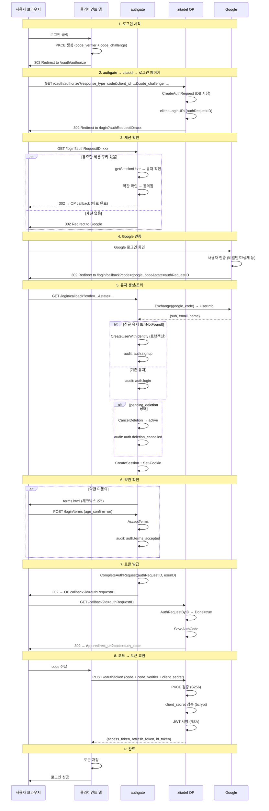

# Spec 001: 브라우저 로그인 (Authorization Code + PKCE)

## 개요

웹 앱 사용자가 브라우저에서 Google 계정으로 로그인하고 access_token + refresh_token을 받는 플로우.

## 전제 조건

- 앱이 `oauth_clients` 테이블에 등록되어 있어야 함 (client_id, redirect_uri)
- authgate에 Google OAuth 자격증명이 설정되어 있어야 함 (GOOGLE_CLIENT_ID, GOOGLE_SECRET)
- 사용자가 Google 계정을 보유해야 함

## 표준

- OAuth 2.1 Authorization Code Grant
- RFC 7636 (PKCE, S256 필수)
- OpenID Connect Core 1.0

## 플로우



## 토큰 내용

```json
{
  "sub": "uuid-of-user",
  "iss": "https://auth.example.com",
  "aud": "my-app",
  "email": "kim@gmail.com",
  "name": "김철수",
  "scope": "openid profile email",
  "exp": 1234567890,
  "iat": 1234567000
}
```

## 에러 케이스

| 상황 | 응답 | HTTP |
|------|------|------|
| client_id 미등록 | `invalid_client` | 400 |
| redirect_uri 불일치 | `invalid_request` | 400 |
| PKCE 없음 | `invalid_request` | 400 |
| Google 인증 실패 | `upstream_error` | 500 |
| DB 오류 (유저 조회) | `internal_error` | 500 |
| 계정 비활성 (disabled) | `account_inactive` | 403 |
| 연령 미확인 | `invalid_request` | 400 |
| 만료된 auth request | 무시 (0 rows update) | — |

## 보안 요구사항

- PKCE S256 필수 (plain 불허)
- client_secret은 bcrypt 해시로 검증
- 세션 쿠키: HttpOnly, SameSite=Lax, Secure (프로덕션)
- access_token 수명: 15분 (기본)
- refresh_token: SHA-256 해시 저장, family_id로 rotation 추적
