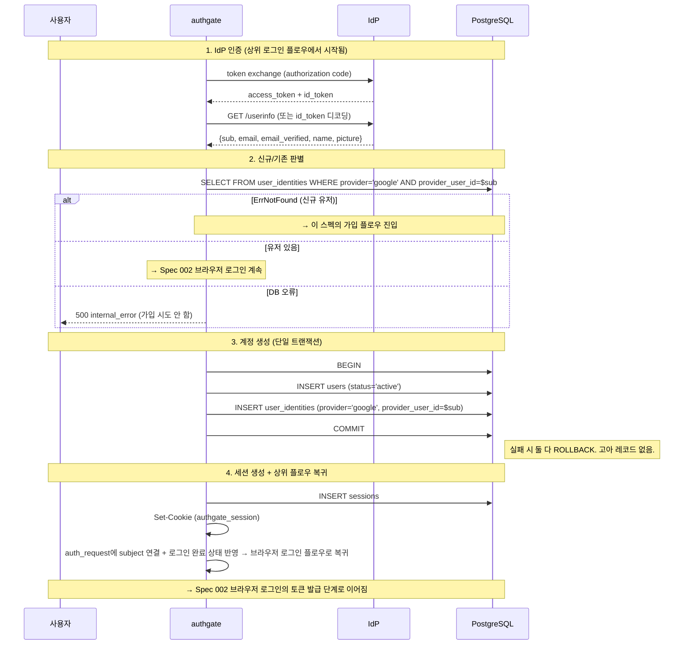

# Spec 001: 브라우저 최초 가입 (자동 프로비저닝)

## 본질

이 스펙은 독립적인 "회원가입 기능"이 아니다.
**브라우저 로그인(Spec 002) 내부의 분기**로, 최초 로그인 시 자동으로 계정을 생성하는 서브플로우다.

```
사용자가 "가입"을 인식하지 않는다.
로그인했더니 처음이라 계정이 생긴 것이다.
```

**가입은 브라우저를 통해서만 가능하다.**
Spec 003(디바이스)과 004(MCP)는 이미 가입이 완료된 사용자의 후속 로그인 채널이다.

약관/개인정보 동의는 **각 앱이 자체 관리**한다. authgate는 순수 인증 서비스이며, 약관 게이트를 제공하지 않는다.

## 전제 조건

- 사용자가 OIDC IdP 계정을 보유해야 함
- authgate에 유효한 IdP 설정이 되어 있어야 함
- authgate에서 zitadel은 내장 라이브러리다 (별도 서버가 아님)

## 관련 엔드포인트

| Method | Path | 처리 | 설명 |
|--------|------|------|------|
| GET | `/login/callback` | authgate | IdP 코드 교환 → 신규/기존 판별 → 가입 처리 |

가입은 `/login/callback` 내부에서 발생한다. 별도 가입 엔드포인트는 없다.

## 식별자 모델

```
핵심 식별자: provider + provider_user_id (IdP sub)
부가 정보:   email, name (표시/편의용)
```

| 식별자 | 역할 | 불변? | 조회 기준? |
|--------|------|-------|-----------|
| `provider + provider_user_id` | 계정 연결의 유일한 기준 | 예 (IdP sub는 변하지 않음) | **예** |
| `email` | 표시용 | 아니오 (IdP에서 변경 가능) | 아니오 |
| `name` | 표시용 | 아니오 | 아니오 |
| `users.id` (UUID) | authgate 내부 식별자 | 예 | 토큰의 `sub` 클레임 |

**동일 email, 다른 IdP sub는 다른 사람이다.** email로 계정을 찾지 않는다.

## 플로우



## 이메일 충돌 정책

| 상황 | 원인 | 처리 |
|------|------|------|
| 같은 email, 같은 IdP sub | 기존 유저 재로그인 | 정상 (로그인 플로우) |
| 같은 email, 다른 IdP sub | 다른 사람이 같은 이메일 사용 | `email_conflict` 에러 (409) |
| 다른 email, 같은 IdP sub | IdP에서 이메일 변경 | 기존 유저로 로그인 (sub 기준) |

`email_conflict`는 시스템 에러(500)가 아니라 **정책 충돌**(409)이다.
현재는 멀티 IdP를 지원하지 않으므로 발생 확률은 매우 낮다.

## 가입 시 생성되는 데이터

```
users:
  id:              UUID (자동 생성) → 토큰의 sub 클레임
  email:           IdP 이메일 (표시용)
  email_verified:  IdP 검증 결과
  name:            IdP 프로필 이름
  avatar_url:      IdP picture (프로필 이미지 URL)
  status:          'active'

user_identities:
  user_id:          위 users.id
  provider:         'google'
  provider_user_id: IdP sub (불변 식별자, 조회 기준)
  provider_email:   IdP 이메일 (가입 시점 기록)
```

상세 스키마는 [Spec 007 데이터 모델](007-data-model.md)을 참조.

## 가입 조건

| 조건 | 충족 방법 | 미충족 시 |
|------|----------|----------|
| IdP 인증 성공 | OIDC IdP 인증 | 가입 불가 |
| DB 조회 성공 | PostgreSQL 정상 | 500 (가입 시도 안 함) |
| identity 미존재 | `ErrNotFound` | 기존 유저 → 로그인 플로우 |
| 이메일 미충돌 | `users.email` UNIQUE 통과 | 409 `email_conflict` |

## 가입 제한

현재 authgate는 **자동 가입 (open signup)** 모델이다.
OIDC IdP 인증에 성공하면 누구나 가입할 수 있다.

향후 가입 제한이 필요하면 (SHOULD):
- 이메일 도메인 제한
- 초대 코드
- 승인 모드

## 에러 케이스

| 상황 | 에러 코드 | HTTP | 설명 |
|------|----------|------|------|
| IdP 인증 실패 (사용자 취소) | — | 302 | 앱의 redirect_uri로 `error=access_denied` |
| IdP 서버 오류 | `upstream_error` | 500 | IdP 연동 실패 |
| DB 오류 (유저 조회) | `internal_error` | 500 | 가입 시도 안 함 |
| 이메일 충돌 (같은 email, 다른 sub) | `email_conflict` | 409 | 정책 충돌 — 운영자 확인 필요 |
| 트랜잭션 실패 (user+identity) | `internal_error` | 500 | 전부 ROLLBACK, 고아 없음 |

## 감사 로그

| 이벤트 | 시점 | 필드 |
|--------|------|------|
| `auth.signup` | 계정 생성 직후 | user_id, ip, user_agent |

## 다른 스펙과의 관계

```
Spec 001 (가입)은 Spec 002 (브라우저 로그인)에서만 진입 가능하다.

Spec 002 (브라우저) ── /login/callback 내부에서 ──→ Spec 001 (가입)
                                                       ↓
                                                  가입 완료 후
                                                       ↓
                                              Spec 002 토큰 발급으로 복귀

Spec 003 (디바이스) ── 가입 완료된 사용자만 사용 가능
Spec 004 (MCP) ────── 가입 완료된 사용자만 사용 가능
```
