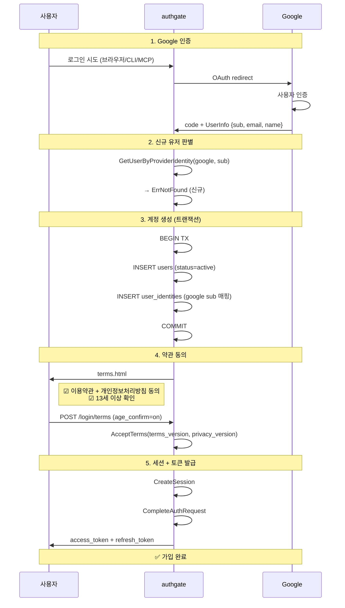

# Spec 001: 가입

## 개요

신규 사용자가 Google 계정으로 최초 로그인 시, 약관 동의와 연령 확인을 거쳐 authgate에 계정이 생성되는 플로우.

## 전제 조건

- 사용자가 Google 계정을 보유해야 함
- authgate에 유효한 IdP 설정이 되어 있어야 함

## 가입 vs 로그인

authgate에는 별도 가입 화면이 없다. Google 로그인 결과로 자동 판별한다.

```
Google 로그인 성공
  → GetUserByProviderIdentity
    → 유저 있음 → 로그인 (Spec 002/003/004)
    → 유저 없음 → 가입 (이 스펙)
```

## 플로우



## 가입 시 생성되는 데이터

```sql
-- users 테이블
{
  id:             UUID (자동 생성),
  email:          Google 이메일,
  email_verified: Google 검증 결과,
  name:           Google 프로필 이름,
  status:         'active',
  terms_version:  현재 약관 버전,
  terms_accepted_at: NOW()
}

-- user_identities 테이블
{
  user_id:         위 users.id,
  provider:        'google',
  provider_user_id: Google sub (불변 식별자)
}
```

## 가입 조건

| 조건 | 충족 방법 | 미충족 시 |
|------|----------|----------|
| Google 인증 성공 | Google OAuth | 가입 불가 |
| 약관 동의 | 체크박스 | 토큰 발급 안 됨 |
| 연령 확인 (13세 이상) | 체크박스 | 토큰 발급 안 됨 |
| 이메일 미중복 | users.email UNIQUE | 500 에러 (동일 이메일 다른 Google 계정) |

## 가입 제한

현재 authgate는 **자동 가입 (open signup)** 모델이다.
Google 인증에 성공하면 누구나 가입할 수 있다.

향후 가입 제한이 필요하면 (SHOULD 항목):
- 이메일 도메인 제한
- 초대 코드
- 승인 모드 (pending → 관리자 승인 → active)

## 에러 케이스

| 상황 | 응답 | HTTP |
|------|------|------|
| Google 인증 실패 | `upstream_error` | 500 |
| 이메일 중복 (DB 제약) | `internal_error` | 500 |
| DB 오류 (유저 조회) | `internal_error` (가입 시도 안 함) | 500 |
| identity 생성 실패 | rollback (유저도 안 만듦) | 500 |
| 약관 미동의 | terms.html 재표시 | 200 |
| 연령 미확인 | `invalid_request` | 400 |

## 감사 로그

가입 성공 시 기록:
```
event: auth.signup
user_id: 생성된 UUID
ip: 요청 IP
```

약관 동의 시 기록:
```
event: auth.terms_accepted
terms_version: 동의한 버전
privacy_version: 동의한 버전
```
