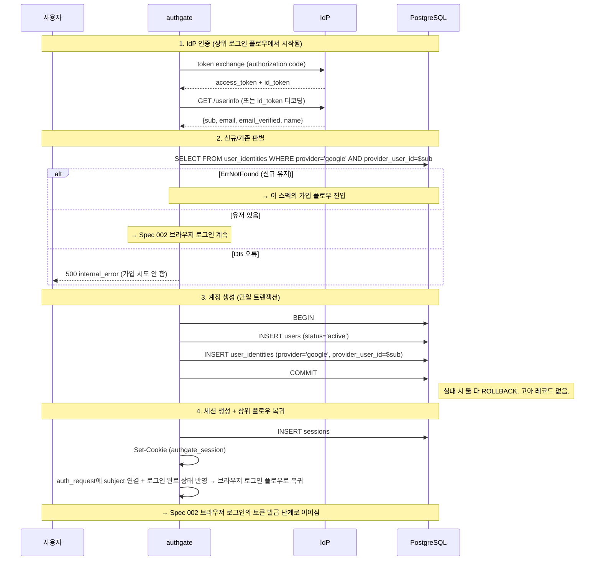

# Spec 001: 브라우저 최초 가입 (자동 프로비저닝)

## 본질

이 스펙은 독립적인 "회원가입 기능"이 아니다.
**브라우저 로그인(Spec 002) 내부의 분기**로, 최초 로그인 시 자동으로 계정을 생성하는 서브플로우다.

```
사용자가 "가입"을 인식하지 않는다.
로그인했더니 처음이라 계정이 생긴 것이다.
```

**가입은 브라우저를 통해서만 가능하다.**
Spec 003(디바이스)과 004(MCP)는 이미 가입이 완료된 사용자의 후속 로그인 채널이다.

약관/개인정보 동의는 **각 앱이 자체 관리**한다. authgate는 순수 인증 서비스이며, 약관 게이트를 제공하지 않는다.

## 전제 조건

- 사용자가 OIDC IdP 계정을 보유해야 함
- authgate에 유효한 IdP 설정이 되어 있어야 함
- authgate에서 zitadel은 내장 라이브러리다 (별도 서버가 아님)

## 관련 엔드포인트

| Method | Path | 처리 | 설명 |
|--------|------|------|------|
| GET | `/login/callback` | authgate | IdP 코드 교환 → 신규/기존 판별 → 가입 처리 |

가입은 `/login/callback` 내부에서 발생한다. 별도 가입 엔드포인트는 없다.

## 식별자 모델

```
핵심 식별자: provider + provider_user_id (IdP sub)
부가 정보:   email, name (표시/편의용)
```

| 식별자 | 역할 | 불변? | 조회 기준? |
|--------|------|-------|-----------|
| `provider + provider_user_id` | 계정 연결의 유일한 기준 | 예 (IdP sub는 변하지 않음) | **예** |
| `email` | 표시용 | 아니오 (IdP에서 변경 가능) | 아니오 |
| `name` | 표시용 | 아니오 | 아니오 |
| `users.id` (UUID) | authgate 내부 식별자 | 예 | 토큰의 `sub` 클레임 |

**동일 email, 다른 IdP sub는 다른 사람이다.** email로 계정을 찾지 않는다.

## 플로우


```mermaid
sequenceDiagram
    participant U as 사용자
    participant AG as authgate
    participant IdP as IdP
    participant DB as PostgreSQL

    Note over U,DB: 1. IdP 인증 (상위 로그인 플로우에서 시작됨)
    AG->>IdP: token exchange (authorization code)
    IdP-->>AG: access_token + id_token
    AG->>IdP: GET /userinfo (또는 id_token 디코딩)
    IdP-->>AG: {sub, email, email_verified, name}

    Note over U,DB: 2. 신규/기존 판별
    AG->>DB: SELECT FROM user_identities WHERE provider='google' AND provider_user_id=$sub
    alt ErrNotFound (신규 유저)
        Note over AG,DB: → 이 스펙의 가입 플로우 진입
    else 유저 있음
        Note over AG: → Spec 002 브라우저 로그인 계속
    else DB 오류
        AG-->>U: 500 internal_error (가입 시도 안 함)
    end

    Note over U,DB: 3. 계정 생성 (단일 트랜잭션)
    AG->>DB: BEGIN
    AG->>DB: INSERT users (status='active')
    AG->>DB: INSERT user_identities (provider='google', provider_user_id=$sub)
    AG->>DB: COMMIT
    Note right of DB: 실패 시 둘 다 ROLLBACK. 고아 레코드 없음.

    Note over U,DB: 4. 세션 생성 + 상위 플로우 복귀
    AG->>DB: INSERT sessions
    AG->>AG: Set-Cookie (authgate_session)
    AG->>AG: auth_request에 subject 연결 + 로그인 완료 상태 반영 → 브라우저 로그인 플로우로 복귀
    Note over U,DB: → Spec 002 브라우저 로그인의 토큰 발급 단계로 이어짐
```

## 이메일 충돌 정책

| 상황 | 원인 | 처리 |
|------|------|------|
| 같은 email, 같은 IdP sub | 기존 유저 재로그인 | 정상 (로그인 플로우) |
| 같은 email, 다른 IdP sub | 다른 사람이 같은 이메일 사용 | `email_conflict` 에러 (409) |
| 다른 email, 같은 IdP sub | IdP에서 이메일 변경 | 기존 유저로 로그인 (sub 기준) |

`email_conflict`는 시스템 에러(500)가 아니라 **정책 충돌**(409)이다.
현재는 멀티 IdP를 지원하지 않으므로 발생 확률은 매우 낮다.

## 가입 시 생성되는 데이터

```
users:
  id:              UUID (자동 생성) → 토큰의 sub 클레임
  email:           IdP 이메일 (표시용)
  email_verified:  IdP 검증 결과
  name:            IdP 프로필 이름
  status:          'active'

user_identities:
  user_id:          위 users.id
  provider:         'google'
  provider_user_id: IdP sub (불변 식별자, 조회 기준)
```

상세 스키마는 [Spec 007 데이터 모델](007-data-model.md)을 참조.

## 가입 조건

| 조건 | 충족 방법 | 미충족 시 |
|------|----------|----------|
| IdP 인증 성공 | OIDC IdP 인증 | 가입 불가 |
| DB 조회 성공 | PostgreSQL 정상 | 500 (가입 시도 안 함) |
| identity 미존재 | `ErrNotFound` | 기존 유저 → 로그인 플로우 |
| 이메일 도메인 허용 | `SIGNUP_EMAIL_DOMAINS` 미설정이거나 일치 | 403 `signup_not_allowed` (계정 생성 시도 안 함) |
| 이메일 미충돌 | `users.email` UNIQUE 통과 | 409 `email_conflict` |

## 가입 제한

기본값은 **자동 가입 (open signup)** 이다. `SIGNUP_EMAIL_DOMAINS`가 비어 있으면
OIDC IdP 인증에 성공한 누구나 가입할 수 있다.

### 이메일 도메인 제한

`SIGNUP_EMAIL_DOMAINS`에 콤마 구분 도메인을 설정하면 해당 도메인 이메일만 가입할 수 있다.

```
SIGNUP_EMAIL_DOMAINS=example.com,*.example.com,corp.test
```

항목은 두 가지 형태를 가진다.

| 형태 | 의미 | 예 |
|------|------|-----|
| `example.com` | 그 도메인만 | `a@example.com` ✓ / `a@sub.example.com` ✗ |
| `*.example.com` | 서브도메인만 (**도메인 자체는 불포함**) | `a@sub.example.com` ✓ / `a@example.com` ✗ |

도메인과 서브도메인을 모두 허용하려면 **둘 다 적는다**. 와일드카드가 상위 도메인을
자동으로 포함하지 않는 이유는, 포함 여부가 운영자의 결정이지 표기법의 부수효과가
되어서는 안 되기 때문이다.

| 규칙 | 내용 |
|------|------|
| 매칭 | 정확히 일치, 또는 와일드카드의 **라벨 경계** 일치. `*.example.com`은 `notexample.com`·`evil-example.com`을 허용하지 않는다 |
| 표기 | `example.com` / `@example.com` 모두 허용. 대소문자 무시 |
| 검증 | 점이 없거나 `@`·공백이 섞인 항목, `*`가 선두 `*.` 이외의 위치에 있는 항목, `*.com`처럼 TLD를 대상으로 하는 와일드카드는 **시작 거부** (오타가 조용히 전원 차단으로 이어지지 않게) |
| 비용 | 정규식을 쓰지 않는다. 와일드카드는 `.example.com` 형태로 저장되어 접미사 비교 한 번으로 끝난다 — 항목당 길이 비교 + memcmp, 할당 0. 가입 시 1회만 호출되며 요청마다 도는 경로가 아니다 |
| `email_verified` | 제한이 켜져 있으면 미검증 주소는 도메인이 맞아도 거부. 미검증 주소는 도메인을 증명하지 못하므로, 그렇지 않으면 게이트가 형식적인 것이 된다 |
| 적용 범위 | **가입만.** 이미 존재하는 계정은 도메인이 목록에서 빠져도 계속 로그인된다 |

이미 만들어진 계정을 막는 것은 가입 정책이 아니라 계정 lifecycle(`user.Status`)의 일이다
([Spec 006](006-account-lifecycle.md)). 도메인 목록에서 항목을 빼는 것만으로 기존 사용자가
잠기지 않는다.

향후 추가 가능한 제한 (SHOULD):
- 초대 코드
- 승인 모드

## 에러 케이스

| 상황 | 에러 코드 | HTTP | 설명 |
|------|----------|------|------|
| IdP 인증 실패 (사용자 취소) | — | 302 | 앱의 redirect_uri로 `error=access_denied` |
| IdP 서버 오류 | `upstream_error` | 500 | IdP 연동 실패 |
| DB 오류 (유저 조회) | `internal_error` | 500 | 가입 시도 안 함 |
| 도메인 미허용 / 미검증 이메일 | `signup_not_allowed` | 403 | `SIGNUP_EMAIL_DOMAINS` 설정 시. 계정을 만들지 않고 거부 — 만든 뒤 막으면 운영자가 저장에 동의한 적 없는 row가 남는다 |
| 이메일 충돌 (같은 email, 다른 sub) | `email_conflict` | 409 | 정책 충돌 — 운영자 확인 필요 |
| 트랜잭션 실패 (user+identity) | `internal_error` | 500 | 전부 ROLLBACK, 고아 없음 |

## 감사 로그

| 이벤트 | 시점 | 필드 |
|--------|------|------|
| `auth.signup` | 계정 생성 직후 | user_id, ip, user_agent |
| `auth.signup_denied` | 도메인 게이트 거부 시 | ip, user_agent, `reason`(`domain_not_allowed` / `email_unverified` / `email_malformed`), `domain`, `channel`, `client_id`, `client_name`. 계정이 아직 없으므로 **user_id는 null** |

## 다른 스펙과의 관계

```
Spec 001 (가입)은 Spec 002 (브라우저 로그인)에서만 진입 가능하다.

Spec 002 (브라우저) ── /login/callback 내부에서 ──→ Spec 001 (가입)
                                                       ↓
                                                  가입 완료 후
                                                       ↓
                                              Spec 002 토큰 발급으로 복귀

Spec 003 (디바이스) ── 가입 완료된 사용자만 사용 가능
Spec 004 (MCP) ────── 가입 완료된 사용자만 사용 가능
```
