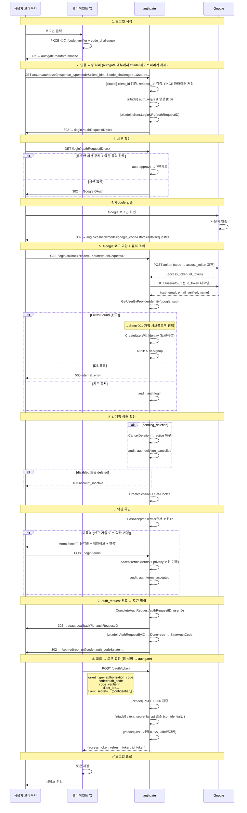

# Spec 002: 브라우저 로그인 (Authorization Code + PKCE)

## 개요

웹 앱 사용자가 브라우저에서 Google 계정으로 로그인하고 access_token + refresh_token을 받는 플로우.
신규 사용자면 [Spec 001 (가입)](001-signup.md) 서브플로우를 거친 후 토큰을 발급한다.

## 전제

- authgate에서 zitadel/oidc는 **내장 라이브러리**다. 별도 서버가 아니다. 모든 엔드포인트는 authgate의 단일 주소에서 제공된다.
- 앱이 `oauth_clients` 테이블에 등록되어 있어야 함
- authgate에 Google OAuth 자격증명이 설정되어 있어야 함

## 클라이언트 유형

| 유형 | client_secret | PKCE | 예시 |
|------|-------------|------|------|
| **confidential** | 있음 (bcrypt 해시 저장) | 필수 | 백엔드 웹 앱, BFF |
| **public** | 없음 (NULL) | 필수 (유일한 보호 수단) | SPA, 모바일 앱 |

토큰 요청 시:
- confidential: `code_verifier` + `client_secret` 둘 다 전송
- public: `code_verifier`만 전송 (`client_secret` 없음)

## 관련 엔드포인트

모든 경로는 authgate 주소 기준이다 (예: `https://auth.example.com`).

| Method | Path | 내부 처리 | 설명 |
|--------|------|----------|------|
| GET | `/oauth/authorize` | zitadel 라이브러리 | 인증 시작 (PKCE, redirect_uri, client_id 검증, auth_request 생성) |
| GET | `/login` | authgate 핸들러 | 세션 확인 → 유효하면 auto-approve, 없으면 Google redirect |
| GET | `/login/callback` | authgate 핸들러 | Google 코드 교환 → 신규/기존 판별 → 세션 생성 |
| GET | `/login/terms` | authgate 핸들러 | 약관 미동의 시 약관 페이지 표시 |
| POST | `/login/terms` | authgate 핸들러 | 약관 동의 처리 |
| POST | `/oauth/token` | zitadel 라이브러리 | code + code_verifier (+ client_secret) → 토큰 발급 |
| GET | `/.well-known/openid-configuration` | zitadel 라이브러리 | OIDC Discovery |
| GET | `/.well-known/jwks.json` | zitadel 라이브러리 | 공개키 (토큰 검증용) |

## 표준

- OAuth 2.1 Authorization Code Grant
- RFC 7636 (PKCE, S256 필수)
- OpenID Connect Core 1.0

## 플로우



## 사용자 체감

| 상황 | 사용자가 보는 것 | 리다이렉트 수 |
|------|----------------|-------------|
| 세션 있음 + 약관 동의 완료 | 로그인 클릭 → 바로 완료 | 4 |
| 세션 없음 + 기존 유저 | 로그인 클릭 → Google → 완료 | 6 |
| 세션 없음 + 신규 유저 | 로그인 클릭 → Google → 약관 → 완료 | 6 + 약관 페이지 1회 |

## 토큰 내용

```json
{
  "iss": "https://auth.example.com",
  "sub": "user-uuid-123",
  "aud": "my-app",
  "exp": 1234567890,
  "iat": 1234567000,
  "scope": "openid profile email",
  "email": "kim@gmail.com",
  "name": "김철수"
}
```

`sub`는 필수. `email`, `name`은 요청한 scope에 따라 포함되는 선택적 클레임.
토큰 상세는 [Spec 005 토큰 Lifecycle](005-token-lifecycle.md) 참조.

## 에러 케이스

| 상황 | 에러 코드 | HTTP | 설명 |
|------|----------|------|------|
| client_id 미등록 | `invalid_client` | 400 | zitadel이 처리 |
| redirect_uri 불일치 | `invalid_request` | 400 | zitadel이 처리 |
| PKCE 없음 / plain | `invalid_request` | 400 | S256만 허용 |
| state 누락/불일치 | `invalid_request` | 400 | CSRF 보호 |
| Google 인증 사용자 취소 | — | 302 | 앱 redirect_uri에 `error=access_denied` |
| Google 서버 오류 | `upstream_error` | 500 | Google 연동 실패 |
| DB 오류 (유저 조회) | `internal_error` | 500 | 가입 시도 안 함 |
| 이메일 충돌 | `email_conflict` | 409 | 같은 email, 다른 Google sub |
| 계정 비활성 (disabled/deleted) | `account_inactive` | 403 | 로그인 차단 |
| 약관/연령 미충족 | — | 200 | 약관 페이지 재표시 |
| 만료된 auth_request | `invalid_request` | 400 | CompleteAuthRequest 시 expires_at 초과 |
| PKCE code_verifier 불일치 | `invalid_grant` | 400 | zitadel이 처리 |
| client_secret 불일치 | `invalid_client` | 401 | confidential 클라이언트만 |

## 보안 요구사항

- PKCE S256 필수 (plain 불허, zitadel이 강제)
- `state` 파라미터: authRequestID를 state로 사용. CSRF 보호 역할
- confidential 클라이언트: client_secret bcrypt 검증
- public 클라이언트: client_secret 없음, PKCE가 유일한 보호
- 세션 쿠키: `HttpOnly`, `SameSite=Lax`, `Secure=!DevMode`
- access_token: 15분 (ACCESS_TOKEN_TTL)
- refresh_token: SHA-256 해시 저장, family_id로 rotation 추적

## 다른 스펙 참조

| 참조 | 내용 |
|------|------|
| [Spec 001](001-signup.md) | 신규 유저 시 가입 서브플로우 (5단계에서 분기) |
| [Spec 005](005-token-lifecycle.md) | 토큰 갱신, 검증, 폐기 |
| [Spec 006](006-account-lifecycle.md) | pending_deletion 복구, disabled 차단 |
| [Spec 007](007-data-model.md) | auth_requests, sessions, refresh_tokens 스키마 |
| [Spec 008](008-pages.md) | terms.html 페이지 스펙 |
