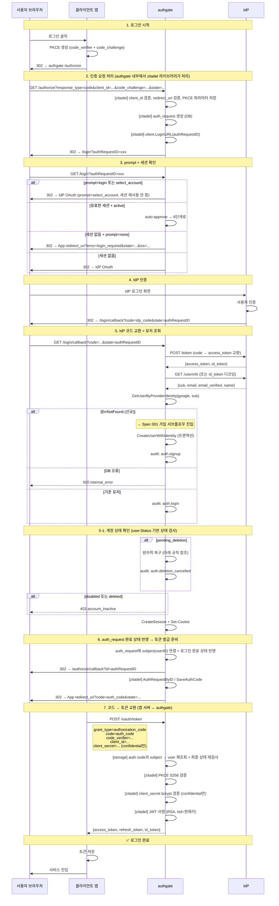

# Spec 002: 브라우저 로그인 (Authorization Code + PKCE)

## 개요

웹 앱 사용자가 브라우저에서 OIDC IdP 계정으로 로그인하고 access_token + refresh_token을 받는 플로우.
신규 사용자면 [Spec 001 (가입)](001-signup.md) 서브플로우를 거친 후 토큰을 발급한다.

## 전제

- authgate에서 zitadel/oidc는 **내장 라이브러리**다. 별도 서버가 아니다. 모든 엔드포인트는 authgate의 단일 주소에서 제공된다.
- 앱이 `clients.yaml`에 등록되어 있어야 함
- authgate에 OIDC 자격증명이 설정되어 있어야 함 (OIDC_ISSUER_URL, OIDC_CLIENT_ID, OIDC_CLIENT_SECRET)
- 모든 `/authorize` 요청은 `code_challenge` + `code_challenge_method=S256`를 반드시 포함해야 함. 예외는 `skip_pkce: true`를 명시한 **browser 채널의** confidential 클라이언트뿐이다.

## 클라이언트 유형

| 유형 | client_secret | PKCE | 예시 |
|------|-------------|------|------|
| **confidential** | 있음 (bcrypt 해시 저장) | 필수 (browser 채널이면 `skip_pkce: true`로 면제 가능) | 백엔드 웹 앱, BFF |
| **public** | 없음 (NULL) | 필수 (유일한 보호 수단, 면제 불가) | SPA, 모바일 앱 |

`skip_pkce`는 `clients.yaml`의 클라이언트별 옵션이며 기본값은 `false`(= PKCE 필수)다.
PKCE를 구현하지 않은 OIDC 라이브러리를 쓰는 앱을 위한 탈출구다 — 예: Gitea는
`markbates/goth`의 openidConnect 프로바이더를 쓰는데 `code_challenge`를 보내지 않는다.
public 클라이언트와 `login_channel: mcp` 클라이언트에는 설정할 수 없다(로드 시 거부).
전자는 시크릿이 없어 PKCE가 인가 코드 가로채기에 대한 유일한 방어이고, 후자는
PKCE S256이 MCP 채널 계약의 일부이기 때문이다 ([Spec 004](004-mcp-login.md)).

토큰 요청 시:
- confidential: `code_verifier` + `client_secret` 둘 다 전송
- public: `code_verifier`만 전송 (`client_secret` 없음)

## 관련 엔드포인트

모든 경로는 authgate 주소 기준이다 (예: `https://auth.example.com`).

| Method | Path | 내부 처리 | 설명 |
|--------|------|----------|------|
| GET | `/authorize` | zitadel 라이브러리 | 인증 시작 (PKCE, redirect_uri, client_id 검증, auth_request 생성) |
| GET | `/login` | authgate 핸들러 | `prompt` 확인 → 세션 확인 → 유효하면 auto-approve, 없으면 IdP redirect (`prompt=none`이면 `login_required`) |
| GET | `/login/callback` | authgate 핸들러 | IdP 코드 교환 → 신규/기존 판별 → 클라이언트 접근 정책 → 세션 생성 |
| POST | `/oauth/token` | zitadel 라이브러리 | code + code_verifier (+ client_secret) → 토큰 발급 |
| GET | `/.well-known/openid-configuration` | zitadel 라이브러리 | OIDC Discovery |
| GET | `/keys` | zitadel 라이브러리 | 공개키 (토큰 검증용) |

## 표준

- OAuth 2.1 Authorization Code Grant
- RFC 7636 (PKCE, S256 필수)
- OpenID Connect Core 1.0 (`prompt` 파라미터 §3.1.2.1)
- RFC 9207 (authorization response `iss`)

## 플로우


```mermaid
sequenceDiagram
    participant U as 사용자 브라우저
    participant App as 클라이언트 앱
    participant AG as authgate
    participant G as IdP

    Note over U,G: 1. 로그인 시작
    U->>App: 로그인 클릭
    App->>App: PKCE 생성 (code_verifier + code_challenge)
    App->>U: 302 → authgate /authorize

    Note over U,G: 2. 인증 요청 처리 (authgate 내부에서 zitadel 라이브러리가 처리)
    U->>AG: GET /authorize?response_type=code&client_id=...&code_challenge=...&state=...
    AG->>AG: [zitadel] client_id 검증, redirect_uri 검증, PKCE 파라미터 저장
    AG->>AG: [zitadel] auth_request 생성 (DB)
    AG->>AG: [zitadel] client.LoginURL(authRequestID)
    AG->>U: 302 → /login?authRequestID=xxx

    Note over U,G: 3. prompt + 세션 확인
    U->>AG: GET /login?authRequestID=xxx
    alt prompt=login 또는 select_account
        AG->>U: 302 → IdP OAuth (prompt=select_account, 세션 재사용 안 함)
    else 유효한 세션 + active
        AG->>AG: auto-approve → 6단계로
    else 세션 없음 + prompt=none
        AG->>U: 302 → App redirect_uri?error=login_required&state=...&iss=...
    else 세션 없음
        AG->>U: 302 → IdP OAuth
    end

    Note over U,G: 4. IdP 인증
    U->>G: IdP 로그인 화면
    G->>G: 사용자 인증
    G->>U: 302 → /login/callback?code=idp_code&state=authRequestID

    Note over U,G: 5. IdP 코드 교환 + 유저 조회
    U->>AG: GET /login/callback?code=...&state=authRequestID
    AG->>G: POST /token (code → access_token 교환)
    G-->>AG: {access_token, id_token}
    AG->>G: GET /userinfo (또는 id_token 디코딩)
    G-->>AG: {sub, email, email_verified, name}

    AG->>AG: GetUserByProviderIdentity(google, sub)
    alt ErrNotFound (신규)
        Note over AG: → Spec 001 가입 서브플로우 진입
        AG->>AG: CreateUserWithIdentity (트랜잭션)
        AG->>AG: audit: auth.signup
    else DB 오류
        AG-->>U: 500 internal_error
    else 기존 유저
        AG->>AG: audit: auth.login
    end

    Note over U,G: 5-1. 계정 상태 확인 (user.Status 기반 상태 검사)
    alt pending_deletion
        AG->>AG: 원자적 복구 (아래 규칙 참조)
        AG->>AG: audit: auth.deletion_cancelled
    end
    alt disabled 또는 deleted
        AG-->>U: 403 account_inactive
    end

    AG->>AG: CreateSession + Set-Cookie

    Note over U,G: 6. auth_request 완료 상태 반영 → 토큰 발급 준비
    AG->>AG: auth_request에 subject(userID) 연결 + 로그인 완료 상태 반영
    AG->>U: 302 → /authorize/callback?id=authRequestID
    AG->>AG: [zitadel] AuthRequestByID / SaveAuthCode
    AG->>U: 302 → App redirect_uri?code=auth_code&state=...

    Note over U,G: 7. 코드 → 토큰 교환 (앱 서버 ↔ authgate)
    App->>AG: POST /oauth/token
    Note right of App: grant_type=authorization_code<br/>code=auth_code<br/>code_verifier=...<br/>client_id=...<br/>client_secret=... (confidential만)
    AG->>AG: [storage] auth code의 subject → user 재조회 + 최종 상태 재검사
    AG->>AG: [zitadel] PKCE S256 검증
    AG->>AG: [zitadel] client_secret bcrypt 검증 (confidential만)
    AG->>AG: [zitadel] JWT 서명 (RSA, kid=현재키)
    AG-->>App: {access_token, refresh_token, id_token}

    Note over U,G: ✅ 로그인 완료
    App->>App: 토큰 저장
    App->>U: 서비스 진입
```

## 사용자 체감

| 상황 | 사용자가 보는 것 | 리다이렉트 수 |
|------|----------------|-------------|
| 세션 있음 + active | 로그인 클릭 → 바로 완료 | 4 |
| 세션 없음 + 기존 유저 | 로그인 클릭 → IdP → 완료 | 6 |
| 세션 없음 + 신규 유저 | 로그인 클릭 → IdP → 완료 | 6 |

## prompt 파라미터

`/authorize`의 `prompt`(OIDC Core §3.1.2.1)는 zitadel이 파싱·검증하고 `auth_requests.prompt`에 저장된다.
`none`을 다른 값과 함께 보내면 zitadel이 `/authorize`에서 `invalid_request`로 거부한다.
`/login`은 세션을 보기 전에 저장된 값을 읽어 다음처럼 동작한다.

| prompt | 유효한 세션 있음 | 세션 없음 |
|--------|----------------|----------|
| 없음 | 세션 재사용 (auto-approve) | IdP redirect |
| `consent` | 없음과 같음. authgate에는 동의 화면이 없다 | 없음과 같음 |
| `login`, `select_account` | 세션을 재사용하지 않고 IdP redirect | IdP redirect |
| `none` | 세션 재사용 (auto-approve, 상태 검사·채널 검증 동일). 단 `pending_deletion` 계정은 **복구하지 않고** `login_required` | 화면·IdP redirect 없이 `login_required` 오류 응답 |

- **IdP로 보내는 prompt**: `login`/`select_account`면 상위 IdP authorize 요청에 `prompt=select_account`를 붙인다.
  Google은 `prompt=login`을 받지 않으며, `select_account`는 로그인된 Google 세션이 있어도 계정 선택 화면을 띄워 다른 계정으로 로그인할 수 있게 한다.
  `select_account`는 **계정 선택을 강제할 뿐 재인증(비밀번호·2FA)을 강제하지 않는다**. Google 세션이 살아 있으면 계정만 고르고 끝날 수 있으므로, `prompt=login`의 "재인증" 의미는 근사치다.
  그 외 경우에는 IdP에 `prompt`를 보내지 않는다. 콜백 이후 처리(가입·상태 검사·새 세션 발급)는 일반 로그인과 같다.
- **`login_required` 응답**: auth_request의 `redirect_uri`(zitadel이 `/authorize`에서 클라이언트 등록값과 대조한 값)로
  `302`하며 query에 `error=login_required`, 원래 `state`, `iss=<PUBLIC_URL>`(RFC 9207)을 붙인다. `code`는 없다.
- **`prompt=none` + `pending_deletion`**: 복구는 탈퇴 요청을 취소하는 동작이라 사용자가 시작한 대화형 로그인에서만 일어난다.
  RP가 페이지 로드마다 돌리는 백그라운드 확인으로 조용히 탈퇴가 취소되지 않도록, `auth.inactive_user`를 기록하고 `login_required`를 보낸다.
- **`prompt=none` + 비활성 계정**: 세션의 계정이 `disabled`/`deleted`면 `auth.inactive_user`를 기록한 뒤 403 화면 대신
  같은 `login_required` 오류 응답을 보낸다. 화면을 띄울 수 없는 요청이므로 RP가 대화형 로그인으로 넘어가게 하고,
  그 대화형 로그인에서 `account_inactive` 화면이 뜬다. 오류 응답에는 계정 상태를 담지 않는다.
- **redirect할 수 없는 오류**: auth_request 없음(400 `auth_request_not_found`)/만료(400 `auth_request_expired`), 채널 불일치는 `prompt=none`이어도 오류 화면을 띄운다.
- **`max_age`와 `auth_time`**: `max_age`는 강제하지 않는다(`prompt=login`에 대해 zitadel이 설정하는 `max_age=0` 포함). ID token의 `auth_time`은
  **auth_request를 완료한 시각**이며, 세션을 재사용한 경우에도 그렇다. 따라서 `auth_time`으로 인증 신선도를 판단하는 RP는 이를 실제 인증 시각으로 믿으면 안 된다.
- **`consent`**: authgate에는 동의 화면이 없어 `consent`를 없는 것으로 취급한다. MCP 채널은 CIMD로 3rd-party 클라이언트도 받지만 동의 화면은 역시 없다([Spec 004](004-mcp-login.md)).
- `/login`은 prompt와 무관하게 먼저 auth_request를 조회하므로, 존재하지 않는 auth_request는 IdP로 보내기 전에 `auth_request_not_found`로 끝난다.

## 클라이언트 접근 정책

클라이언트에 `access` 정책이 있으면([009 운영](009-operations.md#클라이언트-접근-정책-access)) 세션 재사용과 콜백 모두 토큰을 내기 전에 평가한다.

| 경로 | 평가 대상 | 순서 |
|------|----------|------|
| `/login` 세션 재사용 | 세션 계정의 저장된 email·email_verified·hosted_domain | 비활성 계정 → 채널 검증 → **정책** → `pending_deletion` 복구 → 완료 |
| `/login/callback` 신규 | IdP가 준 email·email_verified·hd | 채널 검증 → **정책** → 가입 |
| `/login/callback` 기존 | IdP가 방금 준 email·email_verified·hd (저장된 가입 당시 email이 아님) | 채널 검증 → hd 기록 → 비활성 계정 → **정책** → 복구 → 세션 |
| code 교환 (`/oauth/token`) | 계정의 저장된 email·email_verified·hosted_domain | 상태 검사 → **정책** → 토큰 (거부 시 400 `invalid_grant`) |

거부 시 클라이언트 `redirect_uri`로 `error=access_denied`, `state`, `iss`를 붙여 `302`한다. `prompt=none`도 같다
(`login_required`는 대화형 로그인을 유도하지만 대화형으로도 풀리지 않는다). 거부된 로그인은 세션을 만들지 않고
탈퇴 요청을 취소하지 않는다.

## 토큰 내용

```json
{
  "iss": "https://auth.example.com",
  "sub": "user-uuid-123",
  "aud": "my-app",
  "exp": 1234567890,
  "iat": 1234567000,
  "scope": "openid profile email",
  "email": "kim@gmail.com",
  "name": "김철수"
}
```

`sub`는 필수. `email`, `name`은 요청한 scope에 따라 포함되는 선택적 클레임.
토큰 상세는 [Spec 005 토큰 Lifecycle](005-token-lifecycle.md) 참조.

## 에러 케이스

| 상황 | 에러 코드 | HTTP | 설명 |
|------|----------|------|------|
| client_id 미등록 | `invalid_client` | 400 | zitadel이 처리 |
| redirect_uri 불일치 | `invalid_request` | 400 | zitadel이 처리 |
| PKCE 없음 / plain | `invalid_request` | 400 | S256만 허용 |
| state 누락/불일치 | `invalid_request` | 400 | CSRF 보호 |
| state 쿠키 누락/불일치 (로그인 CSRF) | `authentication failed` | 401 | 상위 핸들러(`rp.CodeExchangeHandler`)가 state 쿠키 검증 실패 시 일반 메시지로 거부 |
| IdP 코드 교환 실패 / IdP 서버 오류 | `authentication failed` | 401 | 상위 핸들러가 교환 실패를 일반 메시지로 거부 (내부 오류 문자열 미노출) |
| DB 오류 (유저 조회) | `internal_error` | 500 | 가입 시도 안 함 |
| 이메일 충돌 | `email_conflict` | 409 | 같은 email, 다른 IdP sub |
| disabled | `account_inactive` | 403 | 로그인 차단 |
| deleted | — | — | `user_identities` 삭제됨 → `ErrNotFound` → Spec 001 신규 가입으로 재진입 |
| pending_deletion | — | — | 에러가 아닌 복구 경로. 자동으로 active 복구 후 진행 (상태 검사) |
| 만료된 auth_request | `invalid_request` | 400 | auth_request 완료/코드 저장 시 expires_at 초과 |
| auth code 발급 후 상태 변경 (`pending_deletion`, `disabled`, `deleted`) | `invalid_grant` | 400 | `/oauth/token` 시점에 subject → user 재조회 후 최종 상태 재검사 |
| PKCE code_verifier 불일치 | `invalid_grant` | 400 | zitadel이 처리 |
| client_secret 불일치 | `invalid_client` | 401 | confidential 클라이언트만 |
| 채널 불일치 (`login_channel: mcp` 클라이언트의 auth_request를 브라우저 경로로 완료 시도) | `channel_mismatch` | 400 | `auth.channel_mismatch` audit 후 거부. `/login`, `/login/callback` 둘 다에서 강제 |
| `prompt=none` + 유효한 세션 없음 또는 비활성 계정 | `login_required` | 302 | 클라이언트 `redirect_uri`로 오류 응답 (`state`, `iss` 포함) |
| 클라이언트 `access` 정책이 계정 거부 (가입·기존 계정·세션 재사용, `prompt=none` 포함) | `access_denied` | 302 | 클라이언트 `redirect_uri`로 오류 응답 (`state`, `iss` 포함). 세션 생성·재사용 안 함, `auth.access_denied` 기록 |
| `prompt=none`과 다른 값 동시 지정 | `invalid_request` | 302 | zitadel이 `/authorize`에서 거부 |

## pending_deletion 복구

pending_deletion 복구는 로그인 완료 절차의 일부로, 다음 순서로 수행한다:

```
1. RecoverUser: `UPDATE ... WHERE status='pending_deletion'`로 active 복구 + deletion 필드 NULL 처리
2. CreateSession: 새 세션 생성
3. CompleteAuthRequest: auth_request에 subject 연결
```

RecoverUser 자체는 원자적이다 (단일 UPDATE).
세션 생성과 auth_request 완료는 별도 호출이지만, 각 단계가 실패해도 안전하다:
- RecoverUser 성공 후 CreateSession 실패 → 복구는 유지됨, 다음 로그인에서 세션 생성
- CreateSession 성공 후 CompleteAuthRequest 실패 → 복구와 세션은 유지됨, 다음 로그인에서 즉시 완료 (재시도 멱등)

채널별 상태 검사 규칙은 [ADR-000](../adr/000-authgate-identity.md#채널별-상태-검사-규칙)을 참조한다.

## 보안 요구사항

- 모든 `/authorize` 요청에서 PKCE S256 필수 (plain 불허, code_challenge 누락 불허). `skip_pkce: true`인 browser 채널 confidential 클라이언트만 예외이며, 그 경우 client_secret이 보호 수단이 된다. 클라이언트 조회에 실패하면 PKCE를 강제한다(fail-safe).
- 상위 IdP 로그인 CSRF 방어: `state`(authRequestID)를 암호화된 state 쿠키에 바인딩하고 콜백에서 대조 (`rp.AuthURLHandler` / `rp.CodeExchangeHandler`). 콜백을 시작한 브라우저만 완료 가능 → 인가코드 인젝션/세션 스왑 차단
- 상위 IdP 교환에 PKCE(S256) 적용 (`rp.WithPKCE`)
- 상위 IdP id_token `nonce` 검증: 로그인 시작 시 요청별 nonce를 생성해 nonce 쿠키 + authorize 파라미터로 보내고, 콜백에서 id_token의 nonce와 대조 (`rp.WithNonce`) → id_token 재생/주입 차단
- confidential 클라이언트: client_secret bcrypt 검증
- public 클라이언트: client_secret 없음, PKCE가 유일한 보호
- 세션 쿠키: `HttpOnly`, `SameSite=Lax`, `Secure=!DevMode`
  - `Strict`이 아닌 이유: 세션 쿠키는 상위 IdP에서 돌아오는 콜백에서 발급된 뒤 리다이렉트를 한 번 더 타야 한다 (디바이스 플로우는 `/device?user_code=`). WebKit은 그 마지막 홉의 same-site 여부를 리다이렉트 체인 전체로 판단하는데, 체인의 시작이 상위 IdP(cross-site)이므로 `Strict` 쿠키를 보내지 않는다. 그 결과 Safari에서는 디바이스 플로우를 완료할 수 없다. Chromium은 홉마다 site-for-cookies를 갱신해 `Strict`도 전송하므로 이 문제가 드러나지 않는다.
  - `Lax`의 노출 범위는 top-level cross-site GET 내비게이션뿐이다. GET 엔드포인트는 스스로 상태를 바꾸지 않으며 (`/device`는 동의 화면 렌더만, `GET /end_session`은 브라우저 사용자의 유효한 `id_token_hint`가 없으면 확인 화면 렌더만), 상태를 바꾸는 `POST /device/approve`와 로그아웃 확인 POST는 CSRF 토큰 이중 제출로 막는다.
- 로그아웃 CSRF 쿠키 (`end_session_csrf`): `HttpOnly`, `SameSite=Strict`, Path=`/end_session`. 로그아웃 확인 화면에서 발급된다.
- CSRF 쿠키 (`csrf_token`): `HttpOnly`, `SameSite=Strict`, Path=`/device`. 동의 화면(authgate 자체 origin)에서 발급되고 같은 origin의 폼 전송에서만 쓰이므로 `Strict`을 유지한다.
- access_token: 15분 (ACCESS_TOKEN_TTL)
- refresh_token: SHA-256 해시 저장, family_id로 rotation 추적

## 다른 스펙 참조

| 참조 | 내용 |
|------|------|
| [Spec 001](001-signup.md) | 신규 유저 시 가입 서브플로우 (5단계에서 분기) |
| [Spec 005](005-token-lifecycle.md) | 토큰 갱신, 검증, 폐기 |
| [Spec 006](006-account-lifecycle.md) | pending_deletion 복구, disabled 차단 |
| [Spec 007](007-data-model.md) | auth_requests, sessions, refresh_tokens 스키마 |
