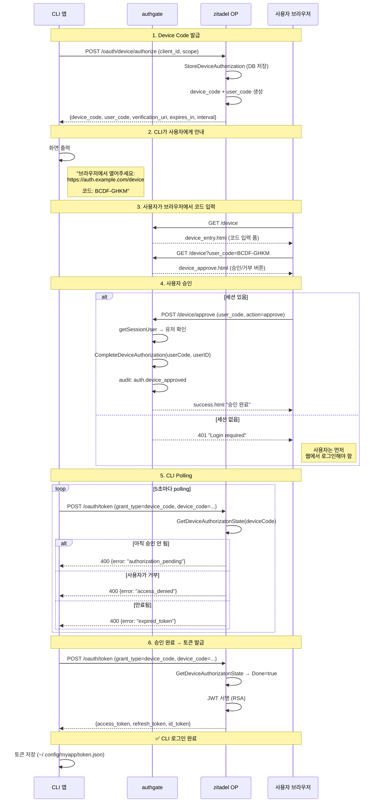
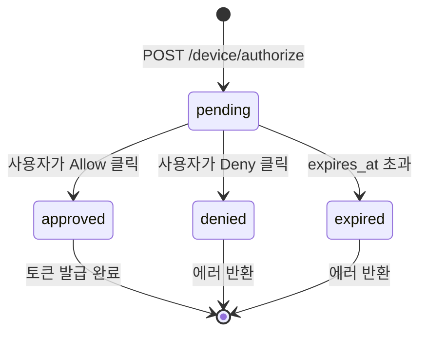

# Spec 002: Device 로그인 (RFC 8628 Device Authorization Grant)

## 개요

CLI 도구나 입력 제한 장치에서 브라우저를 통해 인증하고 access_token + refresh_token을 받는 플로우.

## 전제 조건

- 앱이 `oauth_clients` 테이블에 등록 (grant_type에 device_code 포함)
- 사용자가 브라우저 접근 가능해야 함
- authgate에 유효한 세션이 있거나, Google 로그인 가능해야 함

## 표준

- RFC 8628 (OAuth 2.0 Device Authorization Grant)
- 5분 만료, 5초 polling 간격

## 플로우



## 상태 전이



## DB 테이블

```sql
device_codes (
    device_code  TEXT UNIQUE,   -- CLI에게 전달
    user_code    TEXT UNIQUE,   -- 사용자가 입력 (BCDF-GHKM)
    client_id    TEXT,
    scopes       TEXT[],
    state        TEXT,          -- pending / approved / denied
    subject      TEXT,          -- 승인 시 user_id 설정
    expires_at   TIMESTAMPTZ,  -- 5분
    auth_time    TIMESTAMPTZ   -- 승인 시각
)
```

## 에러 케이스

| 상황 | CLI에게 | HTTP |
|------|--------|------|
| 아직 승인 안 됨 | `authorization_pending` | 400 |
| 사용자가 거부 | `access_denied` | 400 |
| device_code 만료 | `expired_token` | 400 |
| polling 너무 빠름 | `slow_down` | 400 |
| 잘못된 user_code | error 페이지 | 200 (HTML) |
| 세션 없이 승인 시도 | `unauthorized` | 401 |

## 보안 요구사항

- user_code: 대문자만, 모호한 문자 제외 (0/O, 1/I 등)
- device_code: 충분한 엔트로피 (base20, 8자)
- 만료된 device_code는 승인 불가 (WHERE expires_at > NOW())
- polling 간격 5초 강제 (zitadel이 처리)
