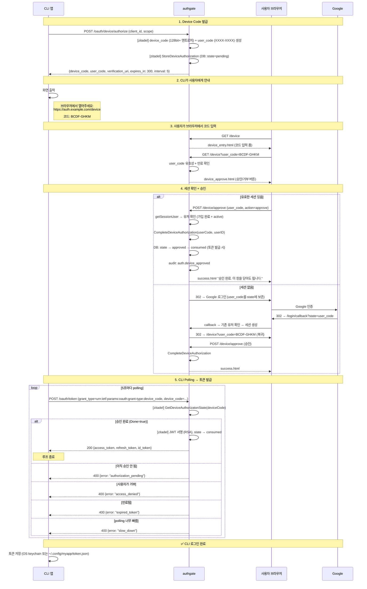
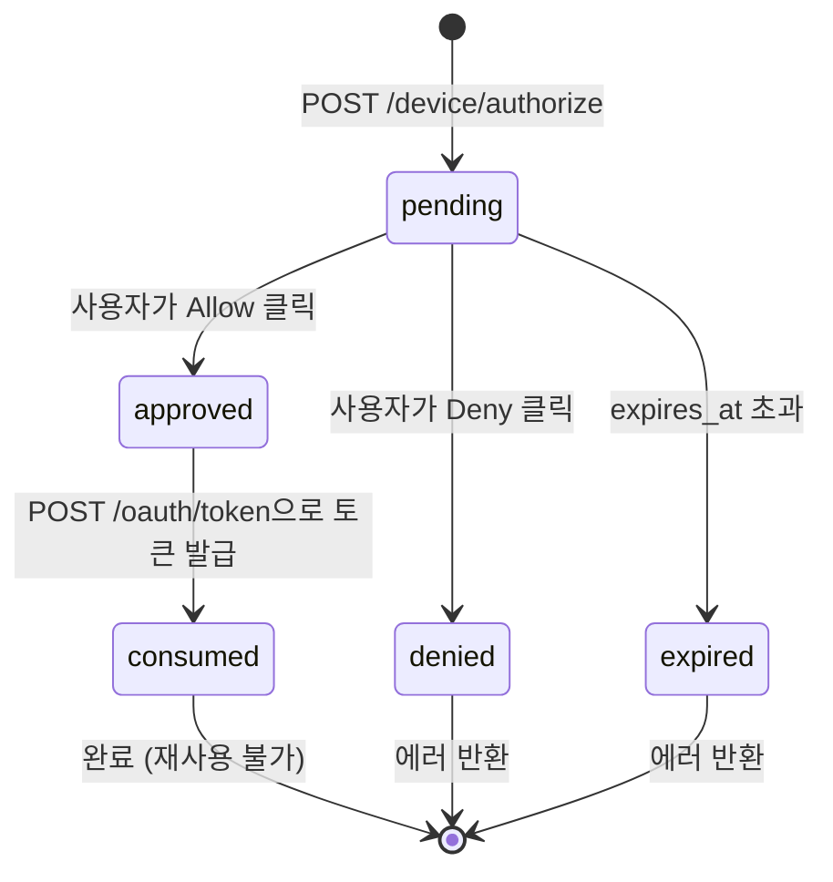

# Spec 003: Device 로그인 (RFC 8628 Device Authorization Grant)

## 개요

CLI 도구나 입력 제한 장치에서 브라우저를 통해 인증하고 access_token + refresh_token을 받는 플로우.
**사용자는 브라우저 가입(Spec 001)이 완료된 상태여야 한다.** Device 플로우에서 신규 가입은 발생하지 않는다.

## 전제

- authgate에서 zitadel/oidc는 **내장 라이브러리**다. 별도 서버가 아니다.
- 앱이 `oauth_clients` 테이블에 등록 (grant_type에 device_code 포함)
- **사용자가 이미 가입 완료** (Spec 001 경유, `terms_accepted_at IS NOT NULL`)
- 사용자가 브라우저 접근 가능해야 함

## 관련 엔드포인트

모든 경로는 authgate 주소 기준이다.

| Method | Path | 내부 처리 | 설명 |
|--------|------|----------|------|
| POST | `/oauth/device/authorize` | zitadel 라이브러리 | device_code + user_code 발급 |
| GET | `/device` | authgate 핸들러 | user_code 입력 폼 |
| GET | `/device?user_code=XXXX` | authgate 핸들러 | 승인/거부 페이지 (세션 필요) |
| POST | `/device/approve` | authgate 핸들러 | 사용자 승인/거부 처리 |
| POST | `/oauth/token` | zitadel 라이브러리 | grant_type=device_code → polling → 토큰 발급 |

## 표준

- RFC 8628 (OAuth 2.0 Device Authorization Grant)
- 5분 만료, 5초 polling 간격

## 플로우



## 상태 전이



`consumed` 상태가 있어야 토큰 발급 후 device_code 재사용을 막을 수 있다.

## 세션 없이 승인 시 흐름

Device 플로우의 주요 사용자(CLI 첫 사용자)는 브라우저 세션이 없을 가능성이 높다.
이 경우 **로그인 → 복귀** 패턴으로 처리한다:

```
1. /device?user_code=XXXX → 세션 없음 감지
2. Google 로그인 redirect (user_code를 state에 보존)
3. Google 인증 성공 → /login/callback
4. 세션 생성 → /device?user_code=XXXX로 302 redirect
5. 승인 페이지 표시 → 사용자 승인
```

**가입 미완료 사용자가 Device 플로우에 진입하면:**
로그인 callback에서 `GetUserByProviderIdentity → ErrNotFound` → 가입은 여기서 발생하지 않는다.
대신 "브라우저에서 먼저 가입해주세요" 에러를 반환한다.

## 에러 케이스

| 상황 | 대상 | 에러 코드 | HTTP | 설명 |
|------|------|----------|------|------|
| 아직 승인 안 됨 | CLI | `authorization_pending` | 400 | 계속 polling |
| 사용자가 거부 | CLI | `access_denied` | 400 | polling 종료 |
| device_code 만료 | CLI | `expired_token` | 400 | 재시작 필요 |
| polling 너무 빠름 | CLI | `slow_down` | 400 | interval + 5초 |
| 이미 토큰 발급됨 (consumed) | CLI | `invalid_grant` | 400 | 재사용 불가 |
| 잘못된/만료된 user_code | 브라우저 | — | 200 | 에러 메시지 포함 HTML |
| 세션 없이 승인 시도 | 브라우저 | — | 302 | Google 로그인으로 redirect |
| 가입 미완료 사용자 | 브라우저 | `signup_required` | 403 | 브라우저 가입 먼저 필요 |
| 비활성 계정 (disabled/deleted) | 브라우저 | `account_inactive` | 403 | 승인 불가 |

## 보안 요구사항

- device_code: 128bit 이상 엔트로피 (32 hex 또는 22 base64url). 추측 불가
- user_code: 대문자만, 모호한 문자 제외 (0/O, 1/I 등). XXXX-XXXX 형식
- 만료된 device_code는 승인 불가 (`WHERE expires_at > NOW()`)
- polling 간격 5초 강제 (`slow_down` 응답 시 +5초)
- `consumed` 상태의 device_code는 재사용 불가

## 다른 스펙 참조

| 참조 | 내용 |
|------|------|
| [Spec 001](001-signup.md) | 가입은 브라우저 전용. Device에서 신규 가입 불가 |
| [Spec 005](005-token-lifecycle.md) | CLI가 받은 토큰의 갱신/폐기 |
| [Spec 007](007-data-model.md) | device_codes 테이블 스키마 |
| [Spec 008](008-pages.md) | device_entry.html, device_approve.html, success.html |
