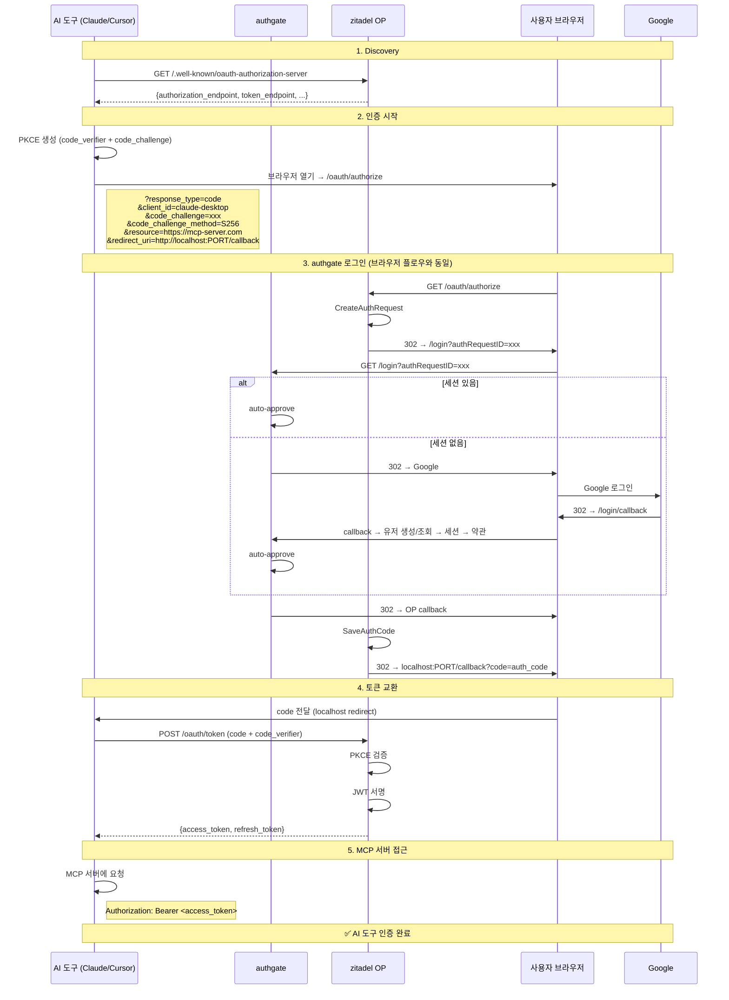

# Spec 003: MCP 로그인 (Model Context Protocol OAuth 2.1)

## 개요

AI 도구 (Claude Desktop, Cursor 등)가 MCP 서버에 접근하기 위해 authgate에서 인증하고 access_token + refresh_token을 받는 플로우.

## 전제 조건

- MCP 클라이언트(AI 도구)가 OAuth 2.1을 지원해야 함
- authgate에 해당 MCP 클라이언트가 `oauth_clients`에 등록되어 있어야 함
- 사용자가 브라우저 접근 가능해야 함 (Auth Code flow)

## 표준

- OAuth 2.1 (IETF draft-ietf-oauth-v2-1)
- RFC 7636 (PKCE, S256 필수)
- RFC 8414 (OAuth Authorization Server Metadata)
- RFC 8707 (Resource Indicators) — MCP 클라이언트가 전송, authgate는 현재 무시
- MCP Spec 2025-03-26 Authorization

## 브라우저 로그인과의 차이

| | 브라우저 로그인 | MCP 로그인 |
|---|---|---|
| 클라이언트 | 웹 앱 (개발자가 구현) | AI 도구 (Claude, Cursor) |
| OAuth flow | Auth Code + PKCE | Auth Code + PKCE (**동일**) |
| Discovery | `/.well-known/openid-configuration` | `/.well-known/oauth-authorization-server` |
| 추가 파라미터 | 없음 | `resource` (RFC 8707) |
| 클라이언트 등록 | DB에 수동 등록 | 수동 등록 (DCR은 SHOULD) |
| 토큰 결과 | access + refresh | access + refresh (**동일**) |

**핵심: MCP 로그인은 브라우저 로그인과 거의 동일합니다. OAuth 2.1 + PKCE.**

## 플로우



## MCP 특이사항

### Resource Indicator (RFC 8707)

```
MCP 클라이언트가 보내는 것:
  /oauth/authorize?...&resource=https://my-mcp-server.com

의미:
  "이 토큰을 my-mcp-server.com에서 사용할 것이다"

현재 authgate 동작:
  resource 파라미터를 무시 (에러 없이 진행)
  → 대부분의 MCP 클라이언트에서 동작함

향후 필요 시:
  미들웨어로 resource를 읽어서 토큰의 aud 클레임에 반영 (~30줄)
```

### Discovery 엔드포인트

```
OIDC:  /.well-known/openid-configuration      ← 웹 앱용
MCP:   /.well-known/oauth-authorization-server ← MCP 클라이언트용

zitadel/oidc가 두 가지 모두 자동 제공.
```

### Dynamic Client Registration (DCR)

```
현재: 미지원 (MUST NOT — ADR-002)
MCP spec: SHOULD (권장)

실질적 영향:
  MCP 클라이언트를 oauth_clients 테이블에 수동 등록해야 함.
  Claude Desktop, Cursor 등은 각각 client_id를 미리 발급받아야 함.
```

## 에러 케이스

| 상황 | 응답 | HTTP |
|------|------|------|
| 미등록 클라이언트 | `invalid_client` | 400 |
| PKCE 없음 | `invalid_request` | 400 |
| resource 파라미터 | 무시 (에러 없음) | — |
| Google 인증 실패 | `upstream_error` | 500 |
| 토큰 만료 | `invalid_grant` | 400 |

## 보안 요구사항

- PKCE S256 필수 (MCP spec 요구)
- redirect_uri: localhost 또는 HTTPS만 허용
- access_token 수명: 15분
- refresh_token: 해시 저장 + rotation

## 알려진 제한

1. **RFC 8707 resource 미처리** — zitadel/oidc #794 이슈 오픈. 대부분 MCP 클라이언트에서 문제 없음.
2. **DCR 미지원** — 클라이언트 수동 등록 필요. 소수 MCP 클라이언트면 충분.
3. **MCP-Protocol-Version 헤더** — discovery 시 MCP 클라이언트가 보내지만 authgate는 무시. 동작에 영향 없음.
