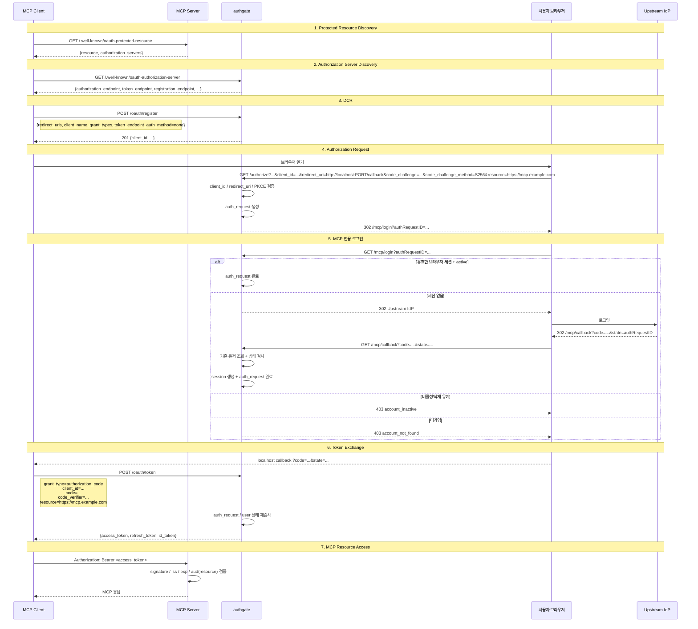

# Spec 004: MCP Authorization (OAuth 2.1 + Protected Resource)

## 개요

AI 도구(Claude Desktop, Cursor 등)가 원격 MCP 서버에 접근하기 위해 authgate에서 인증하고
`access_token + refresh_token`을 받는 플로우.

이 스펙의 핵심은 "MCP 로그인 화면"이 아니라, 아래 3개 컴포넌트가 어떤 계약으로 상호작용하는지다.

```text
+------------------+        +------------------+        +------------------+
|   MCP Client     |        |    MCP Server    |        |    authgate      |
| Claude/Cursor    |        | protected res.   |        | authorization sv |
+--------+---------+        +--------+---------+        +--------+---------+
         |                           |                           |
         | resource metadata 조회    |                           |
         |-------------------------->|                           |
         |<--------------------------|                           |
         |                           |                           |
         | auth server metadata 조회 |                           |
         |------------------------------------------------------>|
         |<------------------------------------------------------|
         |                           |                           |
         | DCR / authorize / token   |                           |
         |------------------------------------------------------>|
         |<------------------------------------------------------|
         |                           |                           |
         | access_token 사용         |                           |
         |-------------------------->|                           |
         |<--------------------------|                           |
```

**사용자는 브라우저 가입(Spec 001)이 완료된 상태여야 한다.**
MCP는 Browser/Device와 같은 "후속 로그인 채널"이며, 신규 가입 채널이 아니다.

## 본질

MCP는 브라우저 로그인과 같은 `authorization_code + PKCE`를 사용하지만,
역할 분리가 더 명확하다.

```text
Browser 로그인
  = 사용자가 직접 앱에 들어가기 위한 로그인

MCP Authorization
  = AI 도구가 특정 MCP 서버(resource)에 접근하기 위한 OAuth 2.1 계약
```

따라서 MCP에서는 다음 요소가 함께 성립해야 한다.

```text
1. authgate는 Authorization Server
2. MCP 서버는 Protected Resource
3. MCP 클라이언트는 resource 파라미터를 포함해 토큰을 요청
4. authgate는 MCP 전용 로그인 경로(/mcp/login, /mcp/callback)를 사용
5. MCP 서버는 받은 access_token이 "자기 resource 용도"인지 검증
```

## 전제

- authgate에서 `zitadel/oidc`는 **내장 라이브러리**다. 별도 서버가 아니다.
- MCP 클라이언트는 OAuth 2.1 `authorization_code + PKCE(S256)`를 지원해야 한다.
- MCP 클라이언트는 RFC 8414 metadata와 RFC 7591 DCR을 사용할 수 있어야 한다.
- authgate에 등록된 OAuth client의 `oauth_clients.login_channel = 'mcp'` 여야 한다.
- **성공적으로 MCP 토큰을 발급받으려면** `user.Status = 'active'` 여야 한다.
- 사용자는 브라우저 접근 가능해야 한다.
- 원격 MCP 서버는 HTTP 기반 protected resource여야 한다.
- 예제 서버는 `Streamable HTTP` 방식으로 구현되어 있다.

## 역할

### MCP Client

```text
책임
  - protected resource metadata 조회
  - authorization server metadata 조회
  - DCR(client_id 동적 등록)
  - PKCE 생성
  - /authorize, /oauth/token 호출
  - localhost redirect 수신
  - access_token으로 MCP 서버 호출
```

### MCP Server

```text
책임
  - /.well-known/oauth-protected-resource 제공
  - 401 + WWW-Authenticate 에 resource_metadata 힌트 제공
  - access_token 검증
  - 자기 resource에 맞는 토큰만 허용
```

### authgate

```text
책임
  - /.well-known/oauth-authorization-server 제공
  - /oauth/register 제공 (DCR)
  - /authorize, /oauth/token, /oauth/revoke 제공
  - MCP 전용 로그인 경로(/mcp/login, /mcp/callback) 처리
  - user 상태 정책 적용
  - JWT access_token / opaque refresh_token 발급
```

## 관련 엔드포인트

### authgate

| Method | Path | 설명 |
|--------|------|------|
| GET | `/.well-known/oauth-authorization-server` | RFC 8414 Authorization Server Metadata |
| GET | `/.well-known/openid-configuration` | OIDC Discovery fallback |
| POST | `/oauth/register` | RFC 7591 Dynamic Client Registration |
| GET | `/authorize` | Authorization Code + PKCE 시작 |
| GET | `/mcp/login` | MCP 전용 로그인 진입 |
| GET | `/mcp/callback` | MCP 전용 upstream callback |
| POST | `/oauth/token` | code + code_verifier → 토큰 발급 |
| POST | `/oauth/revoke` | refresh_token 폐기 |
| GET | `/keys` | JWT 검증용 JWKS |
| GET | `/userinfo` | Bearer 토큰 기반 userinfo |

### MCP Server

| Method | Path | 설명 |
|--------|------|------|
| GET | `/.well-known/oauth-protected-resource` | RFC 9728 Protected Resource Metadata |
| POST/GET | `/mcp` | 실제 MCP transport endpoint |
| GET | `/health` | 헬스체크 |

## 표준

- OAuth 2.1 draft (`authorization_code + PKCE`, public client 전제)
- RFC 7636 (PKCE, `S256` 필수)
- RFC 7591 (Dynamic Client Registration)
- RFC 8414 (OAuth Authorization Server Metadata)
- RFC 8707 (Resource Indicators)
- RFC 9728 (OAuth Protected Resource Metadata)
- MCP Authorization spec

## Browser / Device와의 차이

| 항목 | Browser (Spec 002) | Device (Spec 003) | MCP (이 스펙) |
|------|-------------------|-------------------|---------------|
| 누가 토큰을 쓰는가 | 웹 앱/사용자 | CLI 도구 | AI 도구 |
| 사용자 상호작용 | 브라우저 직접 | 브라우저 승인 | 브라우저 로그인 + 도구 자동 호출 |
| grant | auth code + PKCE | device_code | auth code + PKCE |
| discovery 시작점 | auth server | auth server | protected resource → auth server |
| 추가 파라미터 | 없음 | 없음 | `resource` |
| client 유형 | public/confidential | 보통 public | 보통 public |
| 로그인 경로 | `/login` | `/device` | `/mcp/login` |
| callback 경로 | `/login/callback` | `/device/auth/callback` | `/mcp/callback` |

## 플로우



## Discovery

MCP에서는 보통 Authorization Server discovery보다 **Protected Resource discovery**가 먼저 온다.

```text
MCP Client
  -> MCP Server의 resource metadata 조회
  -> authorization_servers 목록 획득
  -> 그 중 authgate metadata 조회
```

### Protected Resource Metadata

MCP 서버는 `/.well-known/oauth-protected-resource`에서 최소한 아래를 제공해야 한다.

```json
{
  "resource": "https://mcp.example.com",
  "authorization_servers": ["https://auth.example.com"]
}
```

### Authorization Server Metadata

authgate는 `/.well-known/oauth-authorization-server`에서 최소한 아래를 제공해야 한다.

```json
{
  "issuer": "https://auth.example.com",
  "authorization_endpoint": "https://auth.example.com/authorize",
  "token_endpoint": "https://auth.example.com/oauth/token",
  "registration_endpoint": "https://auth.example.com/oauth/register",
  "revocation_endpoint": "https://auth.example.com/oauth/revoke"
}
```

## Dynamic Client Registration (DCR)

MCP 클라이언트는 어떤 MCP 서버에 연결될지 사전에 알 수 없기 때문에,
보통 `client_id`를 미리 박아둘 수 없다.

따라서 authgate는 RFC 7591 기반 DCR을 지원한다.

```text
POST /oauth/register
  -> public client 등록
  -> client_id 자동 생성
  -> oauth_clients.login_channel = 'mcp'
```

등록 규칙:

```text
redirect_uri 허용
  - http://localhost:*
  - http://127.0.0.1:*
  - https://*

기본값
  - grant_types = authorization_code, refresh_token
  - token_endpoint_auth_method = none
  - client_name 비어 있으면 "MCP Client"
```

## 채널 정책

MCP는 Browser와 **같은 code flow를 쓰더라도 정책 채널은 별도**다.

```text
Browser path: /login -> /login/callback
MCP path:     /mcp/login -> /mcp/callback
```

상태 규칙:

```text
user.Status = active
  -> MCP 허용

user.Status = pending_deletion / disabled / deleted
  -> MCP 차단 (account_inactive)
```

MCP는 Device와 같은 "후속 로그인 채널"이다.
가입과 `pending_deletion` 복구는 Browser 채널에서만 처리한다.

## Resource Parameter

MCP에서 `resource`는 부가 옵션이 아니라, "이 토큰을 어느 MCP 서버에서 쓸 것인가"를 나타내는 식별자다.

```text
/authorize?...&resource=https://mcp.example.com
/oauth/token?...&resource=https://mcp.example.com
```

의미:

```text
이 access_token은 https://mcp.example.com resource에 대한 접근 용도다.
```

## 토큰 의미

MCP access_token 계약은 아래와 같다.

```text
access_token
  -> 특정 resource 용도
  -> MCP 서버는 자기 resource용 토큰만 수용
```

authgate는 authorize 단계와 token 단계 모두에서 같은 `resource`를 취급해야 한다.

```text
1. /authorize 요청의 resource를 auth_request에 저장
2. /oauth/token 요청의 resource와 auth_request.resource를 대조
3. 불일치하면 invalid_target 등으로 거부
4. access_token의 aud는 canonical resource로 발급
```

MCP 서버가 검증해야 하는 항목:

```text
1. JWT signature
2. iss = authgate issuer
3. exp = 만료 안 됨
4. aud 또는 동등한 resource 의미 = 내 canonical resource
```

즉 MCP 서버는 단순 JWT 검증기가 아니라,
**"이 토큰이 내 resource 용도인가?"** 를 확인하는 protected resource여야 한다.

## 상태 저장과 수명

authgate는 stateless access token만 발급하는 서버가 아니라, 상태를 가진 인증 게이트다.

```text
DB
├─ oauth_clients    : DCR 등록 결과
├─ auth_requests    : authorize/code 흐름의 단기 상태
├─ sessions         : 브라우저 세션
├─ refresh_tokens   : refresh rotation 상태
├─ users            : 사용자 상태
└─ identities       : upstream identity 연결
```

수명:

```text
oauth_clients
  -> 장기 상태

auth_requests
  -> 짧은 상태 (authorize ~ code exchange)

sessions
  -> 세션 TTL 동안 유지

refresh_tokens
  -> 만료 또는 revoke 후 cleanup
```

`resource`는 `auth_request`와 함께 짧게 유지되는 단기 상태다.
code exchange가 끝나면 auth_request와 함께 정리된다.

## 에러 케이스

| 상황 | 에러 코드 | HTTP | 설명 |
|------|----------|------|------|
| 미등록 클라이언트 | `invalid_client` | 400 | authgate / 라이브러리에서 거부 |
| PKCE 없음 / plain | `invalid_request` | 400 | `S256` 필수 |
| redirect_uri 불일치 | `invalid_request` | 400 | 등록된 redirect_uri와 일치해야 함 |
| DCR redirect_uri 부적합 | `invalid_client_metadata` | 400 | localhost/127.0.0.1/https만 허용 |
| 미가입 사용자 | `account_not_found` | 403 | Browser에서 먼저 가입 필요 |
| 비활성 계정 | `account_inactive` | 403 | `pending_deletion`, `disabled`, `deleted` |
| auth code 발급 후 상태 변경 | `invalid_grant` | 400 | `/oauth/token` 시점에 최종 상태 재검사 |
| code_verifier 불일치 | `invalid_grant` | 400 | PKCE 검증 실패 |
| resource 검증 실패 | `invalid_target` 등 | 400 | authorize/token resource 불일치 또는 허용되지 않은 resource |

## 보안 요구사항

- PKCE `S256` 필수
- public client 기본 (`token_endpoint_auth_method = none`)
- DCR redirect_uri는 localhost/loopback/HTTPS만 허용
- `user.Status = active`일 때만 MCP 토큰 발급
- `/authorize`와 `/oauth/token` 모두에 동일한 `resource` 파라미터를 포함
- authgate는 `auth_requests.resource`를 저장하고 token 교환 시 대조
- MCP access_token의 `aud`는 canonical resource로 발급
- refresh_token은 해시 저장 + rotation
- MCP 서버는 access_token을 모든 요청마다 검증
- MCP 서버는 `iss`, `exp`, signature뿐 아니라 `aud/resource`를 검증
- access_token은 URI query string에 넣지 않는다

예제 서버는 HTTP 기반 원격 MCP 서버의 샘플이며, transport 자체보다 protected resource 계약을 우선 설명한다.

## 다른 스펙 참조

| 참조 | 내용 |
|------|------|
| [Spec 001](001-signup.md) | 가입은 Browser 전용 |
| [Spec 002](002-browser-login.md) | Browser code flow와 공통되는 로그인 골격 |
| [Spec 003](003-device-login.md) | Device는 별도 grant와 별도 상태 저장을 사용 |
| [Spec 005](005-token-lifecycle.md) | refresh/revoke/JWKS 검증 공통 규칙 |
| [Spec 007](007-data-model.md) | `oauth_clients`, `auth_requests`, `refresh_tokens` 스키마 |
