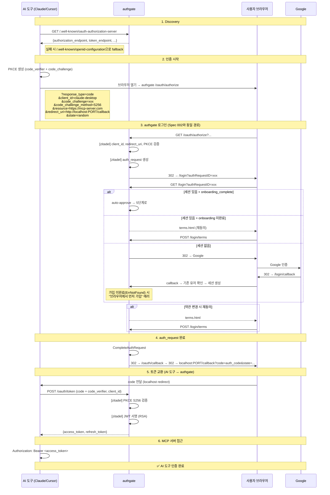

# Spec 004: MCP 로그인 (Model Context Protocol OAuth 2.1)

## 개요

AI 도구 (Claude Desktop, Cursor 등)가 MCP 서버에 접근하기 위해 authgate에서 인증하고 access_token + refresh_token을 받는 플로우.
**사용자는 브라우저 가입(Spec 001)이 완료된 상태여야 한다.**

## 본질

MCP 로그인은 **브라우저 로그인(Spec 002)과 프로토콜이 동일**하다 (Auth Code + PKCE).
다른 점은 **목적**이다:

```
브라우저 로그인: "내가 직접 서비스를 쓰겠다"
MCP 로그인:     "AI 도구가 내 대신 서비스에 접근하겠다"
```

authgate 입장에서는 같은 코드 경로를 탄다. 이 스펙은 MCP 특이사항만 다룬다.

## 전제

- authgate에서 zitadel/oidc는 **내장 라이브러리**다. 별도 서버가 아니다.
- MCP 클라이언트(AI 도구)가 OAuth 2.1을 지원해야 함
- authgate에 해당 MCP 클라이언트가 `oauth_clients`에 등록되어 있어야 함
- `DeriveLoginState = onboarding_complete` (Spec 001 경유, [ADR-000](../adr/000-authgate-identity.md) 정의)
- 사용자가 브라우저 접근 가능해야 함

## 관련 엔드포인트

모든 경로는 authgate 주소 기준이다.

| Method | Path | 내부 처리 | 설명 |
|--------|------|----------|------|
| GET | `/.well-known/oauth-authorization-server` | zitadel 라이브러리 | RFC 8414 Discovery (MCP 클라이언트 우선 시도) |
| GET | `/.well-known/openid-configuration` | zitadel 라이브러리 | OIDC Discovery (fallback) |
| GET | `/oauth/authorize` | zitadel 라이브러리 | 인증 시작 (PKCE + resource 파라미터) |
| GET | `/login` | authgate 핸들러 | 세션 확인 → Google redirect |
| GET | `/login/callback` | authgate 핸들러 | Google 코드 교환 → 유저 조회 → auto-approve |
| GET | `/login/terms` | authgate 핸들러 | 약관 변경 시 재동의 표시 |
| POST | `/login/terms` | authgate 핸들러 | 약관 동의 처리 |
| POST | `/oauth/token` | zitadel 라이브러리 | code + code_verifier → 토큰 발급 |
| GET | `/.well-known/jwks.json` | zitadel 라이브러리 | 공개키 |

## 표준

- OAuth 2.1 (IETF draft-ietf-oauth-v2-1)
- RFC 7636 (PKCE, S256 필수)
- RFC 8414 (OAuth Authorization Server Metadata)
- RFC 8707 (Resource Indicators) — MCP 클라이언트가 전송, authgate는 현재 무시
- MCP Spec 2025-03-26 Authorization

## Spec 002 (브라우저)와의 차이

| 항목 | 브라우저 (Spec 002) | MCP (이 스펙) |
|------|-------------------|-------------|
| **누가 쓰는가** | 사용자 본인 | AI 도구 (사용자 대리) |
| **신뢰 모델** | 사용자가 직접 조작 | 도구가 자동으로 API 호출 |
| **OAuth flow** | Auth Code + PKCE | Auth Code + PKCE (**동일**) |
| **Discovery** | `openid-configuration` | `oauth-authorization-server` (우선) → `openid-configuration` (fallback) |
| **추가 파라미터** | 없음 | `resource` (RFC 8707) |
| **클라이언트 유형** | confidential 또는 public | 보통 public (로컬 앱) |
| **redirect_uri** | 앱 서버 URL | `http://localhost:PORT/callback` |
| **revoke 시나리오** | 로그아웃 | "이 AI 도구 접근 취소" |

**authgate 코드 경로는 동일.** 차이는 클라이언트 등록 정보와 사용 목적뿐이다.

## 플로우



## MCP 특이사항

### Discovery

MCP 클라이언트는 RFC 8414 (`oauth-authorization-server`)를 먼저 시도하고,
없으면 OIDC Discovery (`openid-configuration`)로 fallback한다.
zitadel/oidc가 둘 다 자동 제공하므로 authgate 추가 작업 없음.

### Resource Indicator (RFC 8707)

```
MCP 클라이언트가 보내는 것:
  /oauth/authorize?...&resource=https://my-mcp-server.com

의미: "이 토큰을 my-mcp-server.com에서 사용할 것이다"

현재 authgate: resource 파라미터를 무시 (에러 없이 진행)
영향: 대부분의 MCP 클라이언트에서 동작함
향후: 클라이언트가 aud 검증을 시작하면 미들웨어로 대응 (~30줄)
```

### Dynamic Client Registration (DCR)

```
현재: 미지원 (MUST NOT — ADR-000 Non-Goals)
MCP spec: SHOULD (권장)
실질적 영향: MCP 클라이언트를 oauth_clients에 수동 등록. Spec 009 참조.
```

## 에러 케이스

| 상황 | 에러 코드 | HTTP | 설명 |
|------|----------|------|------|
| 미등록 클라이언트 | `invalid_client` | 400 | zitadel이 처리 |
| PKCE 없음 / plain | `invalid_request` | 400 | S256 필수 |
| redirect_uri 불일치 | `invalid_request` | 400 | localhost 또는 HTTPS만 |
| 가입 미완료 사용자 | `signup_required` | 403 | 브라우저 가입 먼저 필요 |
| Google 서버 오류 | `upstream_error` | 500 | Google 연동 실패 |
| 비활성 계정 | `account_inactive` | 403 | disabled/deleted/pending_deletion |
| resource 파라미터 | — | — | 무시 (에러 없음) |
| code_verifier 불일치 | `invalid_grant` | 400 | zitadel이 처리 |

## 보안 요구사항

- PKCE S256 필수 (MCP spec + OAuth 2.1 요구)
- redirect_uri: `http://localhost:*` 또는 HTTPS만 허용
- MCP 클라이언트는 보통 public client (client_secret 없음)
- access_token 수명: 15분 (MCP 세션 중 자동 갱신)
- refresh_token: 해시 저장 + rotation

## 알려진 제한

1. **RFC 8707 resource 미처리** — zitadel/oidc 이슈 오픈. MCP 클라이언트가 aud 검증 시작하면 미들웨어 추가 필요.
2. **DCR 미지원** — 클라이언트 수동 등록 (Spec 009). 소수 MCP 클라이언트면 충분.

## 다른 스펙 참조

| 참조 | 내용 |
|------|------|
| [Spec 001](001-signup.md) | 가입은 브라우저 전용. MCP에서 신규 가입 불가 |
| [Spec 002](002-browser-login.md) | 동일한 Auth Code + PKCE 플로우 (authgate 내부 코드 경로 동일) |
| [Spec 005](005-token-lifecycle.md) | AI 도구의 토큰 갱신 (15분마다 자동) |
| [Spec 009](009-operations.md) | MCP 클라이언트 등록 방법 |
