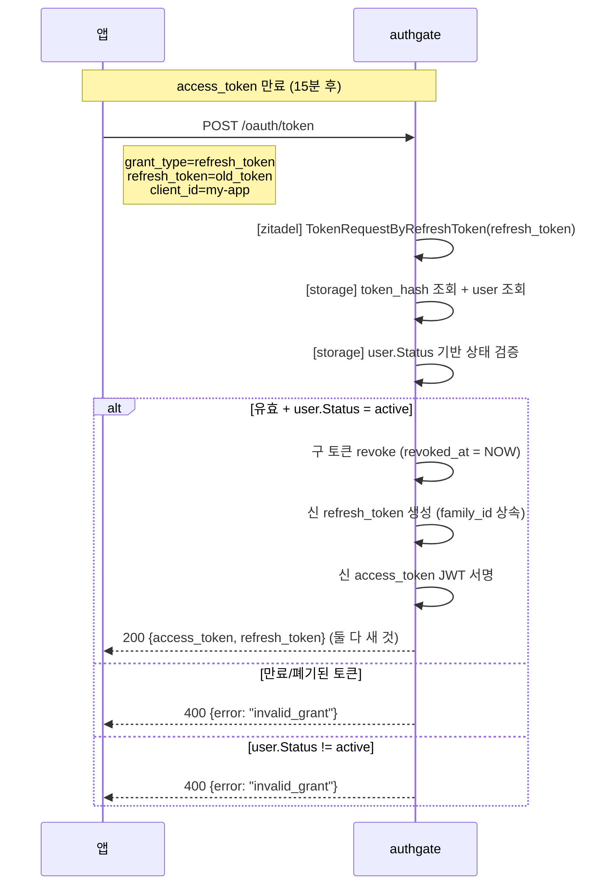
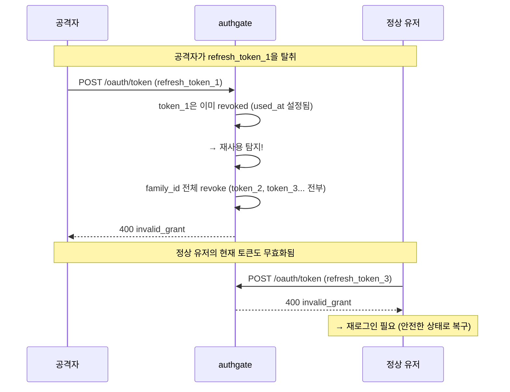
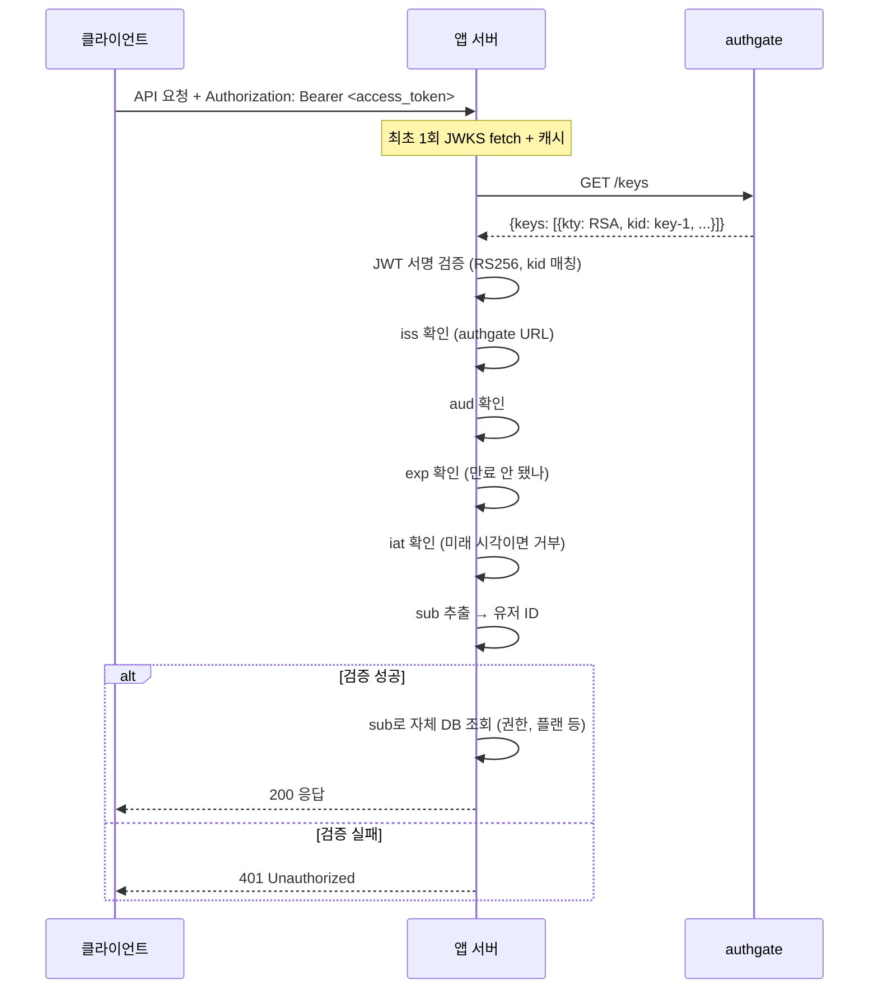
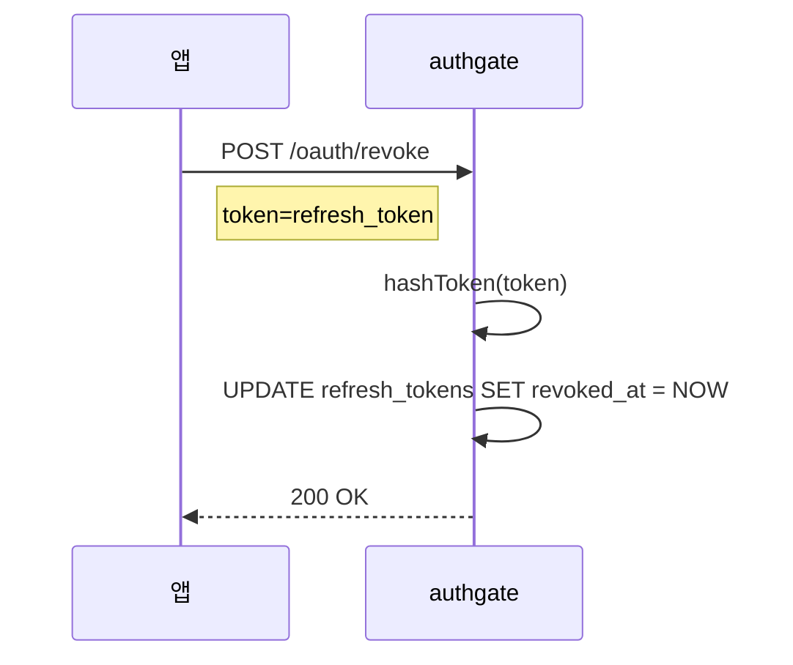

# Spec 005: 토큰 Lifecycle

## 개요

authgate가 발급한 토큰의 갱신, 검증, 폐기 흐름.
로그인 방식(브라우저/CLI/MCP)에 관계없이 **동일한 lifecycle 규칙**이 적용되지만,
`aud` 같은 일부 토큰 의미는 채널별로 다를 수 있다.

## 전제

- authgate에서 zitadel/oidc는 **내장 라이브러리**다. 모든 엔드포인트는 authgate 단일 주소.
- 토큰 발급은 Spec 002(브라우저), 003(디바이스), 004(MCP)에서 완료된 후 이 스펙의 대상이 된다.
- **검증은 앱 책임.** authgate는 발급과 갱신만 한다.

## 관련 엔드포인트

| Method | Path | 내부 처리 | 설명 |
|--------|------|----------|------|
| POST | `/oauth/token` | zitadel 라이브러리 | grant_type=refresh_token → 토큰 갱신 (rotation) |
| POST | `/oauth/revoke` | zitadel 라이브러리 | refresh_token 폐기 |
| GET | `/keys` | zitadel 라이브러리 | 공개키 (앱이 JWT 검증에 사용) |
| GET | `/.well-known/openid-configuration` | zitadel 라이브러리 | Discovery (엔드포인트 URL 조회) |

## 토큰 종류

| 토큰 | 형식 | 수명 | 용도 | DB 저장 |
|------|------|------|------|---------|
| access_token | JWT (RS256) | 15분 (ACCESS_TOKEN_TTL) | API 호출 | 안 함 (stateless) |
| id_token | JWT (RS256) | 1시간 | 사용자 식별 확인 | 안 함 |
| refresh_token | opaque (UUID) | 30일 (REFRESH_TOKEN_TTL) | access_token 갱신 | SHA-256 해시로 저장 |

## 토큰 갱신 (Refresh)



### Refresh Token Rotation

매 갱신마다 refresh_token도 새로 발급된다 (rotation).
구 토큰은 즉시 폐기. 같은 refresh_token을 두 번 사용할 수 없다.

```
family_id: 최초 로그인에서 생성된 UUID
  └── refresh_token_1 (발급 → 사용 → 폐기)
  └── refresh_token_2 (발급 → 사용 → 폐기)
  └── refresh_token_3 (현재 유효)
```

`family_id`는 하나의 로그인 세션에서 파생된 모든 refresh_token을 추적한다.

### Refresh Token Rotation 원자성

동일 refresh_token으로 동시 요청이 오면 둘 다 유효로 판정될 수 있다. 이를 방지하기 위해 rotation은 원자적이어야 한다:

```
1. SELECT refresh_tokens ... FOR UPDATE WHERE token_hash = $hash
2. revoked_at / used_at / expires_at 검사
3. 유효하면 used_at = NOW(), revoked_at = NOW() 갱신
4. 새 refresh_token row INSERT (같은 family_id)
5. COMMIT
```

**규칙**:
- 같은 refresh_token은 정확히 1번만 성공. 두 번째 동시 요청은 `invalid_grant`.
- 이미 used/revoked 토큰 재제출 시 family 전체 revoke (아래 재사용 탐지 참조).

### 토큰 재사용 탐지 (Family Invalidation)

이미 사용(폐기)된 refresh_token이 다시 제출되면 — **토큰 탈취 의심**:



**규칙**: 폐기된 토큰이 제출되면, 해당 `family_id`의 모든 토큰을 즉시 revoke한다.
정상 유저는 재로그인해야 하지만, 공격자의 토큰도 무효화된다.

## 계정 상태별 토큰 동작

[ADR-000](../adr/000-authgate-identity.md) 상태 판정 규칙과 일치:

| user.Status | 토큰 갱신 (refresh) | 기존 access_token | 설명 |
|------------|-------------------|------------------|------|
| `active` | 허용 | 유효 (만료까지) | 정상 |
| `pending_deletion` | 차단 | 유효 (만료까지, 최대 15분) | 삭제 유예 중 |
| `disabled` / `deleted` | 차단 | 유효 (만료까지, 최대 15분) | 정지/삭제 |

refresh 허용 조건: `user.Status = 'active'`.

**구현 위치 주의**: zitadel의 `RefreshTokenRequest` 인터페이스에는 사용자 상태 정보가 없으므로,
authgate는 `storage.TokenRequestByRefreshToken` 구현 안에서 refresh_token → user를 조회하고
`user.Status` 기반으로 차단 여부를 판단해야 한다.

**access_token(JWT)은 stateless라 서버에서 즉시 폐기할 수 없다.**
disabled/deleted 계정의 access_token은 만료(15분)를 기다린다.
즉시 차단이 필요하면 앱이 자체 blocklist를 운영한다 (sub 기반).

## 토큰 검증 (앱이 수행)

authgate는 토큰을 **발급**만 한다. **검증은 앱 책임**이다.



### 앱의 검증 체크리스트

| 항목 | 필수 | 설명 |
|------|------|------|
| 서명 검증 | **필수** | JWKS 공개키로 RS256, `kid`로 키 매칭 |
| `iss` 확인 | **필수** | authgate의 issuer URL과 일치 |
| `aud` 확인 | **필수** | Browser/Device는 자신의 `client_id`, MCP는 자신의 canonical `resource`와 일치 |
| `exp` 확인 | **필수** | 현재 시각보다 미래 |
| `iat` 확인 | **필수** | 현재 시각보다 과거 (미래면 거부) |
| JWKS 캐시 | **권장** | HTTP Cache-Control 준수, kid miss 시 1회 재fetch |
| 키 회전 지원 | **권장** | 캐시에 없는 kid → 재fetch → 검증. Spec 009 키 로테이션 참조 |
| clock skew | **권장** | ±30초 허용 |

### 채널별 audience 규칙

```text
Browser / Device
  -> aud = OAuth client_id

MCP
  -> aud = canonical resource
```

[Spec 004](004-mcp-login.md)의 MCP 계약에 따라,
MCP 토큰은 특정 protected resource용으로 발급되고 검증되어야 한다.

## 토큰 폐기 (Revoke)



**RFC 7009 준수**: 토큰이 존재하지 않거나 이미 폐기된 경우에도 200 OK 반환.
토큰 존재 여부를 외부에 노출하지 않는다.

## 토큰 저장 보안

| 환경 | access_token | refresh_token |
|------|-------------|--------------|
| 웹 앱 (BFF/서버) | 세션/메모리 | DB 또는 서버 세션 |
| 웹 앱 (SPA) | 메모리만 (localStorage 금지) | BFF 패턴 권장. httpOnly 쿠키 시 `SameSite=Strict; Secure` 필수 |
| CLI | OS keychain 권장 | OS keychain 권장 (`~/.config/`는 차선) |
| MCP 도구 | 도구 내부 메모리 | 도구 내부 storage |

## Token/Session Cleanup

Spec 006의 Cleanup Lifecycle에서 참조하는 토큰/세션 정리 절차:

### Refresh Token Cleanup

```sql
-- revoke 후 30일 경과한 refresh_token hard delete
DELETE FROM refresh_tokens
WHERE revoked_at IS NOT NULL
  AND revoked_at < NOW() - INTERVAL '30 days';

-- 만료 후 30일 경과한 refresh_token hard delete
DELETE FROM refresh_tokens
WHERE expires_at < NOW() - INTERVAL '30 days';
```

revoke 직후 삭제하지 않는 이유: 재사용 탐지(Family Invalidation)를 위해 `used_at`/`revoked_at` 기록이 30일간 필요하다.

### Session Cleanup

```sql
-- 만료된 세션 삭제
DELETE FROM sessions
WHERE expires_at < NOW();

-- revoke된 세션 삭제
DELETE FROM sessions
WHERE revoked_at IS NOT NULL;
```

### 임시 데이터 Cleanup

```sql
-- 만료 후 1시간 경과한 auth_requests 삭제
DELETE FROM auth_requests
WHERE expires_at < NOW() - INTERVAL '1 hour';

-- 만료 후 1시간 경과한 device_codes 삭제
DELETE FROM device_codes
WHERE expires_at < NOW() - INTERVAL '1 hour';
```

이 cleanup들은 주기적 goroutine으로 실행한다 (Spec 009 참조).

## 에러 케이스

| 상황 | 에러 코드 | HTTP | 설명 |
|------|----------|------|------|
| refresh_token 만료 | `invalid_grant` | 400 | 재로그인 필요 |
| refresh_token 이미 사용됨 | `invalid_grant` | 400 | rotation 위반 |
| 재사용 탐지 (탈취 의심) | `invalid_grant` | 400 | family 전체 revoke + 재로그인 |
| 계정 disabled/deleted/pending_deletion | `invalid_grant` | 400 | 토큰 갱신 차단 |
| client_id 불일치 | `invalid_client` | 400 | |

## 다른 스펙 참조

| 참조 | 내용 |
|------|------|
| [ADR-000](../adr/000-authgate-identity.md) | 토큰 계약, 계정 상태별 동작 |
| [Spec 002](002-browser-login.md) | 토큰 최초 발급 (브라우저) |
| [Spec 003](003-device-login.md) | 토큰 최초 발급 (CLI) |
| [Spec 004](004-mcp-login.md) | 토큰 최초 발급 (MCP) |
| [Spec 007](007-data-model.md) | refresh_tokens 테이블 (token_hash, family_id) |
| [Spec 009](009-operations.md) | 키 로테이션 절차 |
