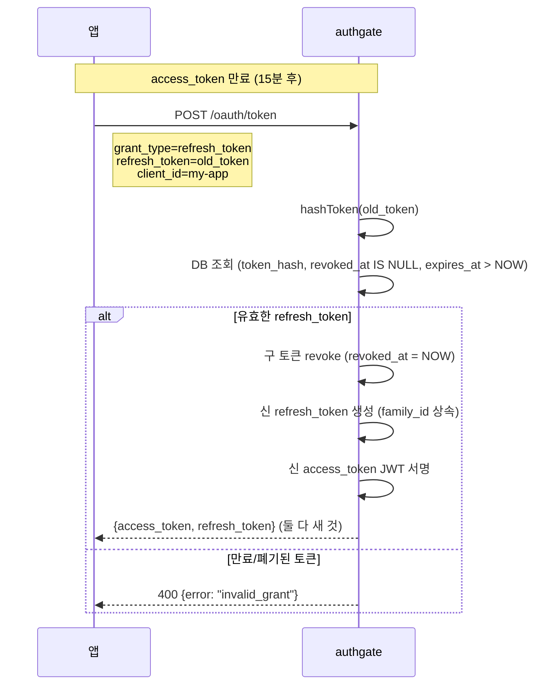
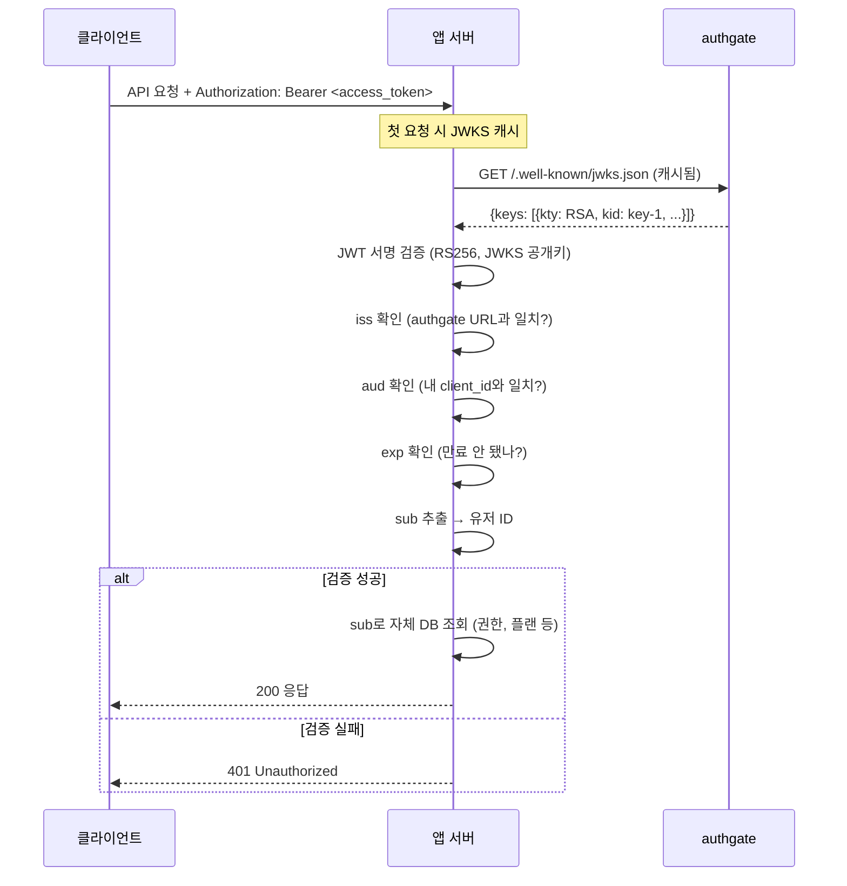
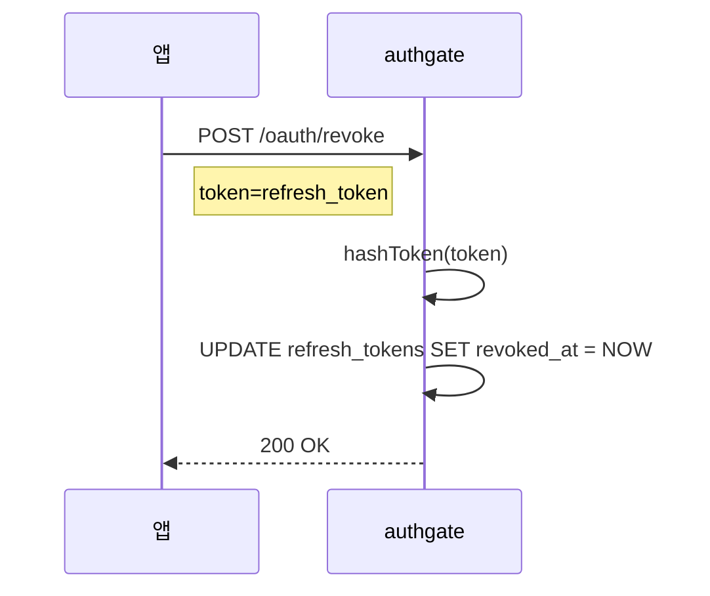

# Spec 005: 토큰 Lifecycle

## 개요

authgate가 발급한 토큰의 갱신, 검증, 폐기 흐름.
로그인 방식(브라우저/CLI/MCP)에 관계없이 동일하게 적용된다.

## 토큰 종류

| 토큰 | 형식 | 수명 | 용도 |
|------|------|------|------|
| access_token | JWT (RS256) | 15분 (기본) | API 호출 |
| id_token | JWT (RS256) | 1시간 | 사용자 식별 확인 |
| refresh_token | opaque (UUID) | 30일 (기본) | access_token 갱신 |

## 토큰 갱신 (Refresh)



### Refresh Token Rotation

매 갱신마다 refresh_token도 새로 발급된다 (rotation).
구 토큰은 즉시 폐기. 같은 refresh_token을 두 번 사용할 수 없다.

```
family_id: 최초 로그인에서 생성된 UUID
  └── refresh_token_1 (발급 → 사용 → 폐기)
  └── refresh_token_2 (발급 → 사용 → 폐기)
  └── refresh_token_3 (현재 유효)
```

`family_id`는 하나의 로그인 세션에서 파생된 모든 refresh_token을 추적한다.

## 토큰 검증 (앱이 수행)

authgate는 토큰을 **발급**만 한다. **검증은 앱 책임**이다.



### 앱의 검증 체크리스트

| 항목 | 필수 | 설명 |
|------|------|------|
| 서명 검증 | **필수** | JWKS 공개키로 RS256 검증 |
| `iss` 확인 | **필수** | authgate의 issuer URL과 일치 |
| `aud` 확인 | **필수** | 자신의 client_id와 일치 |
| `exp` 확인 | **필수** | 현재 시각보다 미래 |
| JWKS 캐시 | **권장** | 매 요청마다 fetch하지 않음 |
| 키 회전 지원 | **권장** | JWKS 캐시 miss 시 재fetch |
| clock skew | **권장** | ±30초 허용 |

## 토큰 폐기 (Revoke)



access_token(JWT)은 서버에서 폐기할 수 없다 — 만료(15분)를 기다린다.
즉시 차단이 필요하면 앱이 자체 blocklist를 운영해야 한다.

## 토큰 저장 보안

| 환경 | access_token | refresh_token |
|------|-------------|--------------|
| 웹 앱 (서버) | 세션/메모리 | DB 또는 세션 |
| 웹 앱 (SPA) | 메모리만 (localStorage 금지) | httpOnly 쿠키 또는 BFF 패턴 |
| CLI | secure storage | secure storage (`~/.config/`) |
| MCP 도구 | 도구 내부 메모리 | 도구 내부 storage |

## DB 저장

| 항목 | 저장 방식 |
|------|----------|
| refresh_token | SHA-256 해시로 저장. 평문 저장 안 함 |
| access_token | 저장 안 함 (JWT — stateless) |
| id_token | 저장 안 함 |
