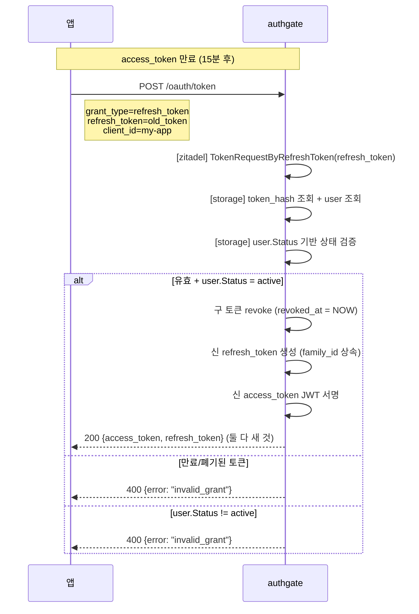
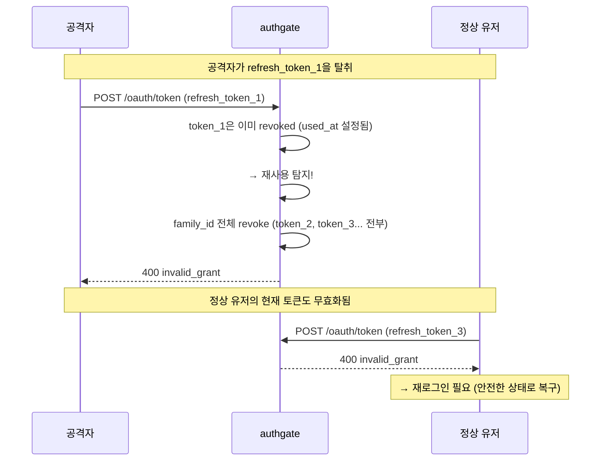
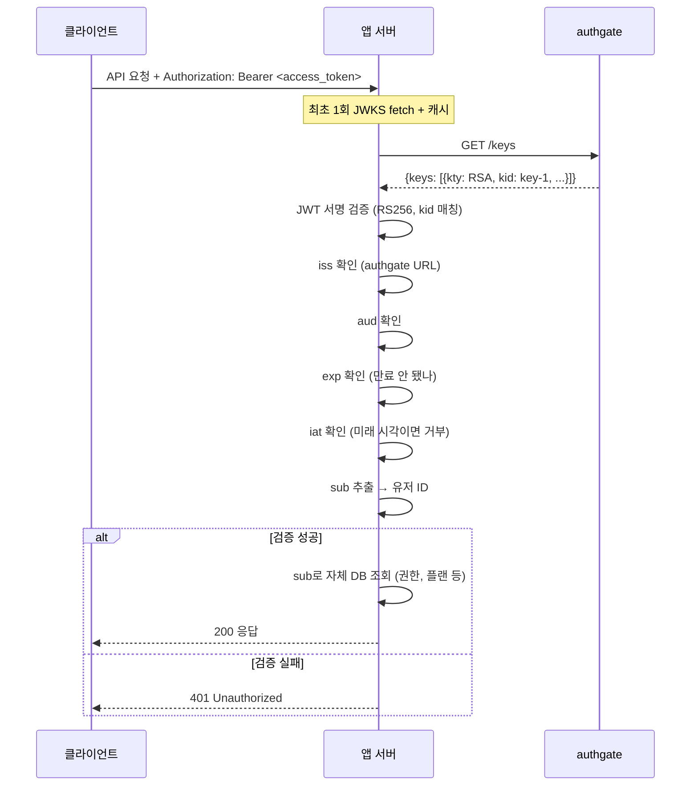
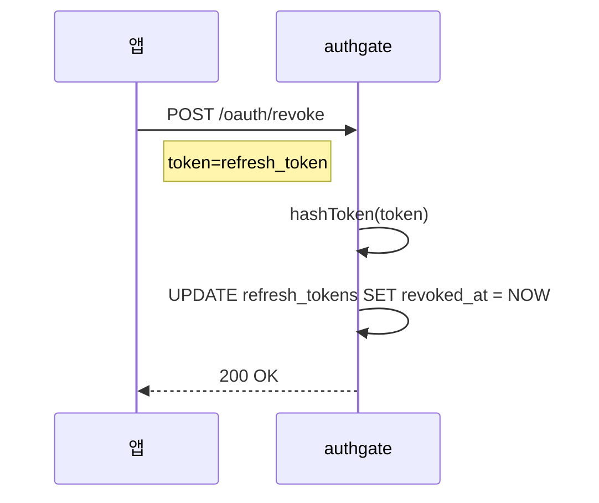

# Spec 005: 토큰 Lifecycle

## 개요

authgate가 발급한 토큰의 갱신, 검증, 폐기 흐름.
로그인 방식(브라우저/CLI/MCP)에 관계없이 **동일한 lifecycle 규칙**이 적용되지만,
`aud` 같은 일부 토큰 의미는 채널별로 다를 수 있다.

## 전제

- authgate에서 zitadel/oidc는 **내장 라이브러리**다. 모든 엔드포인트는 authgate 단일 주소.
- 토큰 발급은 Spec 002(브라우저), 003(디바이스), 004(MCP)에서 완료된 후 이 스펙의 대상이 된다.
- **검증은 앱 책임.** authgate는 발급과 갱신만 한다.

## 관련 엔드포인트

| Method | Path | 내부 처리 | 설명 |
|--------|------|----------|------|
| POST | `/oauth/token` | zitadel 라이브러리 | grant_type=refresh_token → 토큰 갱신 (rotation) |
| POST | `/oauth/revoke` | zitadel 라이브러리 | refresh_token 폐기 |
| GET | `/keys` | zitadel 라이브러리 | 공개키 (앱이 JWT 검증에 사용) |
| GET | `/.well-known/openid-configuration` | zitadel 라이브러리 | Discovery (엔드포인트 URL 조회) |

## 토큰 종류

| 토큰 | 형식 | 수명 | 용도 | DB 저장 |
|------|------|------|------|---------|
| access_token | JWT (RS256) | 15분 (ACCESS_TOKEN_TTL) | API 호출 | 안 함 (stateless) |
| id_token | JWT (RS256) | 1시간 | 사용자 식별 확인 | 안 함 |
| refresh_token | opaque (UUID) | 30일 (REFRESH_TOKEN_TTL) | access_token 갱신 | SHA-256 해시로 저장 |

### JWT 프로파일 (at+jwt) 와 at_hash 바인딩

zitadel 라이브러리는 access_token·id_token을 모두 `typ=JWT`로 서명한다.
RFC 9068 §2.1은 JWT access_token이 `typ=at+jwt`를 갖도록 요구하므로,
`/oauth/token` 응답은 미들웨어(`storage.WrapAccessTokenJWTType`)에서
access_token을 `typ=at+jwt`로 **재서명**한다 (id_token은 `typ=JWT` 유지).

access_token 문자열이 재서명으로 바뀌면 id_token의 `at_hash`
(OIDC Core 1.0 §3.1.3.6, access_token 문자열에 종속)가 옛 값으로 남는다.
따라서 미들웨어는 재서명된 access_token으로 `at_hash`를 다시 계산해
**id_token도 재서명**한다. 이로써 엄격한 OIDC 클라이언트의 at_hash 검증을
통과한다. id_token에 `at_hash`가 없으면 재서명하지 않는다.

## 토큰 갱신 (Refresh)

### Authorization code 소비 경계

RFC 6749 §4.1.2–4.1.3에 따라 code는 client·redirect·PKCE 검증이 끝난
발급 단계에서 조건부 DELETE로 한 번만 소비한다. refresh token을 함께
발급하면 code 소비와 grant INSERT는 같은 DB transaction이다. refresh가
없는 교환도 동일한 소비 검사를 거친다. 라이브러리의 후속 삭제는 멱등이다.

DB transaction 실패는 소비를 rollback한다. commit 뒤 JWT 서명이나 HTTP
전송이 실패하면 code를 복원하지 않는다. 사용자는 새 인증을 시작해야 한다.
일반 검증 오류는 code를 소비하지 않는다.

동일 code 재사용 시 관련 토큰 폐기는 RFC 6749 §4.1.2의 SHOULD다. 현재
구현은 code를 소비 때 삭제하고 access token을 stateless로 발급하므로
재사용 거절을 보장하되 해당 code의 기존 grant를 추적·폐기하지 않는다.
이는 별도 code→grant 보존 모델과 access-token 폐기 상태를 도입하지 않는
선택이며, 이미 발급된 토큰은 TTL 또는 기존 refresh 폐기 정책을 따른다.
재사용 거절 MUST와 이 SHOULD 미채택을 구분한다.


```mermaid
sequenceDiagram
    participant App as 앱
    participant AG as authgate

    Note over App,AG: access_token 만료 (15분 후)
    App->>AG: POST /oauth/token
    Note right of App: grant_type=refresh_token<br/>refresh_token=old_token<br/>client_id=my-app

    AG->>AG: [zitadel] TokenRequestByRefreshToken(refresh_token)
    AG->>AG: [storage] token_hash 조회 + user 조회
    AG->>AG: [storage] user.Status 기반 상태 검증

    alt 유효 + user.Status = active
        AG->>AG: 구 토큰 revoke (revoked_at = NOW)
        AG->>AG: 신 refresh_token 생성 (family_id 상속)
        AG->>AG: 신 access_token JWT 서명
        AG-->>App: 200 {access_token, refresh_token} (둘 다 새 것)
    else 만료/폐기된 토큰
        AG-->>App: 400 {error: "invalid_grant"}
    else user.Status != active
        AG-->>App: 400 {error: "invalid_grant"}
    end
```

### Refresh Token Rotation

매 갱신마다 refresh_token도 새로 발급된다 (rotation).
구 토큰은 즉시 폐기. 같은 refresh_token을 두 번 사용할 수 없다.

```
family_id: 최초 로그인에서 생성된 UUID
  └── refresh_token_1 (발급 → 사용 → 폐기)
  └── refresh_token_2 (발급 → 사용 → 폐기)
  └── refresh_token_3 (현재 유효)
```

`family_id`는 하나의 로그인 세션에서 파생된 모든 refresh_token을 추적한다.

### Refresh Token Rotation 처리 방식

조회는 소비하지 않으며, provider 검증이 끝난 뒤 발급 transaction에서만 소비한다:

```
1) TokenRequestByRefreshToken
   - token 조회, 만료/resource/계정 정책 검사 (소비·폐기 없음)
2) zitadel provider
   - 요청 client 결합과 scope 상한 검증
3) CreateAccessAndRefreshTokens TX
   - family advisory lock → parent row lock
   - 현재 유효성·계정 정책·재사용 판정
   - 정상 소비 used_at/revoked_at + child INSERT 함께 COMMIT
   - 재사용이면 family revoke + tombstone + audit만 COMMIT, invalid_grant
```

Public client는 같은 token으로 최대 한 번 발급된다. 재사용은 family 전체를
폐기한다. Confidential client의 유예는 아래 정책을 따른다.
DB에서 transaction이 abort되면 소비도 rollback된다. COMMIT 응답을 잃으면
성공 여부를 확정할 수 없으므로 같은 토큰의 재시도 성공을 보장하지 않는다.
DB commit 이후 서명/응답 실패는
소비를 되돌리지 않으며, public client는 재인증해야 한다.

### 토큰 재사용 탐지 (Family Invalidation)

이미 사용(폐기)된 refresh_token이 다시 제출되면 — **토큰 탈취 의심**:


```mermaid
sequenceDiagram
    participant Attacker as 공격자
    participant AG as authgate
    participant User as 정상 유저

    Note over Attacker,User: 공격자가 refresh_token_1을 탈취
    Attacker->>AG: POST /oauth/token (refresh_token_1)
    AG->>AG: token_1은 이미 revoked (used_at 설정됨)
    AG->>AG: → 재사용 탐지!
    AG->>AG: family_id 전체 revoke (token_2, token_3... 전부)
    AG-->>Attacker: 400 invalid_grant

    Note over Attacker,User: 정상 유저의 현재 토큰도 무효화됨
    User->>AG: POST /oauth/token (refresh_token_3)
    AG-->>User: 400 invalid_grant
    Note over User: → 재로그인 필요 (안전한 상태로 복구)
```

**규칙**: 폐기된 토큰이 제출되면, 해당 `family_id`의 모든 토큰을 즉시 revoke한다.
정상 유저는 재로그인해야 하지만, 공격자의 토큰도 무효화된다.

재사용 감지는 기존 토큰 행을 revoke하는 동시에 `refresh_token_families`에 해당
`family_id`의 **tombstone**을 남긴다(같은 트랜잭션). 토큰 발급 경로는 rotation 시
family가 tombstone되었는지 확인하고, 되었으면 새 자식 토큰 발급을 거부한다. 이로써
family revoke와 거의 동시에 진행되던 rotation이 끼워넣는 새 토큰까지 차단된다.

**감사 기록 규칙.** `auth.refresh_reuse_detected`는 재사용된 토큰이 제출될 **때마다** 제출자의 IP·User-Agent와 함께
기록한다. 탈취 사건에서는 보통 정상 사용자가 먼저 탐지를 일으키고 공격자가 그 뒤에 (이미 폐기된) 자기 토큰을
제출하므로, 뒤이은 제출 기록이 공격자 접속지의 유일한 증거다. `auth.refresh_family_revoked`는 family를 실제로
폐기한 요청, 즉 tombstone을 **새로 만든** 요청만 기록한다. tombstone insert의 `ON CONFLICT DO NOTHING`이
판정하므로 재사용 요청 둘이 경합해도 폐기 기록은 하나다.

### 재사용 유예 시간 (Reuse Grace)

한 자격증명을 여러 세션이 공유하는 클라이언트(예: 창마다 MCP 연결을 띄우는 Claude Code)는 access_token이
같은 순간 만료되면 **같은 refresh_token으로 거의 동시에** 갱신한다. 먼저 도착한 요청이 토큰을 교환하고 나면
나머지는 "이미 사용된 토큰"이 되어, 유예가 없으면 위 규칙대로 family 전체가 폐기되고 모든 세션이 로그아웃된다.
(2026-09-11 프로덕션: 같은 토큰이 2ms 간격으로 두 번 제출돼 family가 폐기됨.)

**client secret으로 인증한 confidential client만** `REFRESH_TOKEN_REUSE_GRACE_SEC`(기본 5초) 안에 다시 제출된 토큰은 폐기하지 않고 **같은 family에 새 토큰을 하나 더 발급**한다.
기존 세션의 토큰도, 새로 받은 세션의 토큰도 모두 계속 쓸 수 있다.

유예는 아래를 **모두** 만족할 때만 적용된다.

| 조건 | 이유 |
|------|------|
| 토큰이 토큰 엔드포인트에서 **교환**됐다 (`used_at` 설정) | `/oauth/revoke`(hash·id), 사용자 전체 revoke, 계정 삭제, family revoke로 **폐기**된 토큰은 `used_at`을 남기지 않으므로 유예가 없다 |
| 교환 후 유예 시간 이내 | 그 뒤의 재제출은 다시 탈취 의심이다 |
| family가 tombstone되지 않았다 | 재사용 탐지나 `/oauth/revoke`로 폐기된 family는 되살리지 않는다 |
| family에 **교환 없이 폐기된 토큰이 없다** | 사용자 전체 revoke처럼 tombstone 없이 토큰만 폐기된 경우에도, 부모 토큰 재제출로 끝낸 세션을 되살리지 못하게 한다 |
| 이 교환의 자식(`parent_id`가 이 토큰)이 3개 미만 | 유예 창 안에서 한 번의 교환이 낳는 토큰 수를 제한한다. family·시각으로 세면 다른 세션이 같은 순간 교환한 토큰까지 섞이므로 부모로 센다 |

앞의 네 조건 중 하나라도 어긋나면 기존 재사용 탐지(family 폐기)로 간다. 상한(3개)에 도달한 요청은 `invalid_grant`로 거부하지만
**family는 폐기하지 않는다**. 다른 세션이 쓰는 토큰을 지키기 위해서다.

**판정은 발급 시 family와 parent row를 잠근 뒤 한 번 한다.**
조회 당시 상태는 소비를 확정하지 않는다. 발급 시 현재 계정·resource·scope와
위 조건 전체를 검사한다. 같은 family의 소비와 폐기는 직렬화되며,
각 요청은 앞 요청이 commit한 child를 세므로 동시 요청에도 상한이 지켜진다.
정책상 거부는 `400 invalid_grant`, DB 오류는 `500 server_error`다.

교환된 토큰 행이 insert 직전에 사라졌다면(그 사이 계정 purge 등) 새 토큰을 발급하지 않고 `invalid_grant`로 거부한다.

**감사**: 유예로 통과한 요청이 자식을 받으면 `auth.refresh_reuse_grace`(`outcome: issued`), 거부되면 `outcome: refused`를
제출자 IP·User-Agent와 함께 기록한다. 유예 적용 여부는 발급 lock을 획득한 순서로 결정한다.
조회 순서와 무관하게 먼저 소비를 확정한 요청은 정상 교환, 그 뒤 유예로 발급한 요청이 감사 대상이다. 유예 창 안의 재생은 이 기능이 통과시키는 바로 그 경우라, 매 건이 증거다.

**트레이드오프**
- 토큰을 탈취한 공격자가 정상 교환 **직후 유예 시간 안에** 제출하면 재사용 탐지 없이 토큰을 받는다(감사에는 남는다).
- 유예로 받은 토큰도 교환되면 자기 유예 창을 가진다. 공격자가 교환 타이밍을 계속 맞추면 토큰을 여러 개 모을 수 있지만,
  유효한 토큰 하나 이상의 권한은 생기지 않으며, 유예 밖에서 오래된 토큰이 한 번이라도 제출되면 family 전체가 폐기된다.
- 유예를 끄려면 `REFRESH_TOKEN_REUSE_GRACE_SEC=0`. Public client(CIMD/MCP 포함)는 이 설정과 무관하게 즉시 재사용 탐지와 family 폐기를 적용한다. 동시 갱신은 client에서 직렬화해야 한다.

## 계정 상태별 토큰 동작

[ADR-000](../adr/000-authgate-identity.md) 상태 판정 규칙과 일치:

| user.Status | 토큰 갱신 (refresh) | 기존 access_token | 설명 |
|------------|-------------------|------------------|------|
| `active` | 허용 | 유효 (만료까지) | 정상 |
| `pending_deletion` | 차단 | 유효 (만료까지, 최대 15분) | 삭제 유예 중 |
| `disabled` / `deleted` | 차단 | 유효 (만료까지, 최대 15분) | 정지/삭제 |

refresh 허용 조건: `user.Status = 'active'`.

**구현 위치 주의**: zitadel의 `RefreshTokenRequest` 인터페이스에는 사용자 상태 정보가 없으므로,
authgate는 `storage.TokenRequestByRefreshToken` 구현 안에서 refresh_token → user를 조회하고
`user.Status` 기반으로 차단 여부를 판단해야 한다.

**클라이언트 접근 정책**: 클라이언트에 `access` 정책이 있으면 refresh마다 계정의 저장된 email·email_verified·hosted_domain으로
다시 평가하고, 거부되면 `invalid_grant`와 `auth.access_denied`(`channel: refresh`)를 남긴다. 토큰을 소비·revoke하지 않으며
재사용으로도 취급하지 않는다. 재사용 유예 경로(잠금 하 재검증 포함)에서도 같다. 정책 조회는 메모리의 정적 클라이언트 표만 보며
CIMD fetch를 일으키지 않는다([009 운영](009-operations.md#클라이언트-접근-정책-access)).
authorization code 교환(`invalid_grant`, `channel`은 클라이언트의 로그인 채널)과 승인된 device code polling(`channel: device`)도
같은 방식으로 저장된 값으로 다시 평가하므로, 콜백·승인 뒤 교환 전에 좁힌 정책이 토큰 발급을 막는다.

**access_token(JWT)은 stateless라 서버에서 즉시 폐기할 수 없다.**
disabled/deleted 계정의 access_token은 만료(15분)를 기다린다.
즉시 차단이 필요하면 앱이 자체 blocklist를 운영한다 (sub 기반).

## 토큰 검증 (앱이 수행)

authgate는 토큰을 **발급**만 한다. **검증은 앱 책임**이다.


```mermaid
sequenceDiagram
    participant Client as 클라이언트
    participant App as 앱 서버
    participant AG as authgate

    Client->>App: API 요청 + Authorization: Bearer <access_token>

    Note over App: 최초 1회 JWKS fetch + 캐시
    App->>AG: GET /keys
    AG-->>App: {keys: [{kty: RSA, kid: key-1, ...}]}

    App->>App: JWT 서명 검증 (RS256, kid 매칭)
    App->>App: iss 확인 (authgate URL)
    App->>App: aud 확인
    App->>App: exp 확인 (만료 안 됐나)
    App->>App: iat 확인 (미래 시각이면 거부)
    App->>App: sub 추출 → 유저 ID

    alt 검증 성공
        App->>App: sub로 자체 DB 조회 (권한, 플랜 등)
        App-->>Client: 200 응답
    else 검증 실패
        App-->>Client: 401 Unauthorized
    end
```

### 앱의 검증 체크리스트

| 항목 | 필수 | 설명 |
|------|------|------|
| 서명 검증 | **필수** | JWKS 공개키로 RS256, `kid`로 키 매칭 |
| `iss` 확인 | **필수** | authgate의 issuer URL과 일치 |
| `aud` 확인 | **필수** | Browser/Device는 자신의 `client_id`, MCP는 자신의 canonical `resource`와 일치 |
| `exp` 확인 | **필수** | 현재 시각보다 미래 |
| `iat` 확인 | **필수** | 현재 시각보다 과거 (미래면 거부) |
| JWKS 캐시 | **권장** | HTTP Cache-Control 준수, kid miss 시 1회 재fetch |
| 키 회전 지원 | **권장** | 캐시에 없는 kid → 재fetch → 검증. Spec 009 키 로테이션 참조 |
| clock skew | **권장** | ±30초 허용 |

### 채널별 audience 규칙

```text
Browser / Device
  -> aud = OAuth client_id

MCP
  -> aud = canonical resource
```

[Spec 004](004-mcp-login.md)의 MCP 계약에 따라,
MCP 토큰은 특정 protected resource용으로 발급되고 검증되어야 한다.

## 토큰 폐기 (Revoke)


```mermaid
sequenceDiagram
    participant App as 앱
    participant AG as authgate

    App->>AG: POST /oauth/revoke
    Note right of App: token=refresh_token

    AG->>AG: hashToken(token)
    AG->>AG: UPDATE refresh_tokens SET revoked_at = NOW
    AG-->>App: 200 OK
```

**RFC 7009 준수**: 토큰이 존재하지 않거나 이미 폐기된 경우에도 200 OK 반환.
토큰 존재 여부를 외부에 노출하지 않는다.

## Logout vs. Revoke

OIDC RP-Initiated Logout 1.0 §2의 `/end_session` 엔드포인트와 RFC 7009의
`/oauth/revoke` 엔드포인트는 **별개의 개념**이다. authgate는 이 두 경로를 분리해서 처리한다.

| 행위 | 엔드포인트 | 영향 범위 | 감사 이벤트 |
|------|------------|----------|-------------|
| 세션 로그아웃 | `GET`/`POST /end_session` (OIDC RP-Initiated Logout) | 요청한 브라우저의 세션 사용자의 `sessions.revoked_at` 갱신(그 사용자의 모든 세션) + `authgate_session` 쿠키 삭제 | 실제로 세션을 종료했을 때 `auth.logout` 1행 |
| 토큰 폐기 | `/oauth/revoke` (RFC 7009) | 제출된 refresh token이 속한 **grant(family) 전체** `revoked_at` 갱신 + tombstone(`reason=revoked`) | `auth.token_revoked` |
| 재사용 탐지 폐기 | (자동) | family 전체 `revoked_at` 갱신 | `auth.refresh_family_revoked` |

**핵심 계약**:

- `/oauth/revoke`는 제출된 토큰 한 행이 아니라 그 토큰의 **grant 전체**를 폐기한다(RFC 7009 §2.1 허용). 재사용 유예로 한 family에 살아있는 토큰이 여럿일 수 있어, 한 행만 폐기하면 다른 세션이 받은 형제 토큰이 수명 끝까지 살아남기 때문이다. 토큰 원문으로 오든 행 id로 오든(zitadel이 `GetRefreshTokenInfo` 후 id를 넘기거나, 해석에 실패하면 원문을 그대로 넘김) 같다. 단, **요청한 클라이언트에게 발급된 토큰일 때만** 폐기한다(RFC 7009 §2.1). 다른 클라이언트의 토큰이면 아무것도 폐기하지 않고 200을 돌려준다. 감사 행의 `user_id`는 grant 소유자다.
- `/end_session`은 **세션만** 폐기한다. zitadel 기본 핸들러가 아니라 authgate 핸들러(`internal/handler/logout.go`)가 처리한다. authgate는 access token을 stateless로 발급(만료 시각만 검증)하므로 즉시 무효화할 수 없고, refresh token은 자연 만료, 명시적 `/oauth/revoke`, 또는 family 폐기 전까지 유효하다.
- **확인 절차 (RP-Initiated Logout 1.0 §2)**: 요청은 `op.ValidateEndSessionRequest`로 검증한다(`id_token_hint` 서명·issuer, `client_id`와 hint의 `azp` 일치). 클라이언트가 등록하지 않은 `post_logout_redirect_uri`는 따라가지 않고 **버린 뒤 로그아웃을 계속한다**(클라이언트 라이브러리가 기본으로 보내므로 400으로 막으면 로그아웃이 안 된다). 그 밖의 검증 실패는 에러 페이지 400. 이어서 `authgate_session` 쿠키로 브라우저 사용자를 찾는다(비활성 계정의 세션도 종료 대상).

  | 브라우저 세션 쿠키 | 유효한 `id_token_hint` | 동작 |
  |---|---|---|
  | 없음 | 없음 / 있음 | **아무것도 종료하지 않음** → 완료 페이지 |
  | 있음 | 같은 사용자 | 즉시 종료 |
  | 있음 | 없음 / 다른 사용자 | **확인 페이지**. 확인 POST에서 브라우저 사용자만 종료 |

  `/end_session`은 **요청한 브라우저의 세션만** 끝낸다. 세션 쿠키 없이 온 `id_token_hint`로는 아무도 로그아웃시키지 않는다. id_token은 여러 RP에 전달되고 로그·브라우저 기록에 남으며 만료된 것도 hint로 받아들여지므로, 그것을 가졌다는 사실이 소유자의 로그아웃 요청이 아니기 때문이다. 세션 조회가 실패하면(DB 장애 등) 확인 후 쿠키만 지워 이 브라우저라도 로그아웃되게 한다.

  확인 페이지는 원래 파라미터를 hidden 필드로 되돌려 보내고, POST는 다시 파싱·검증한다. 확인 POST는 same-origin 검사(`Sec-Fetch-Site`/`Origin`)와 double-submit CSRF(`__Host-end_session_csrf` 쿠키, dev에서는 `end_session_csrf`: `HttpOnly`, `SameSite=Strict`, Path=`/`, `Secure=!DevMode`, [Spec 002](002-browser-login.md))가 모두 통과해야 하며, 불일치는 403이고 아무것도 종료하지 않는다. 확인 없이는 임의 사이트가 링크 하나로 방문자를 로그아웃시킬 수 있기 때문이다.
- **완료**: 요청이 **실제로 가져온** `authgate_session`(발급 때와 같은 속성, 응답 헤더 `Max-Age=0`)과 CSRF 쿠키만 지운다. 교차 사이트 POST는 Lax 세션 쿠키를 보내지 않지만, 그 top-level 응답의 삭제 `Set-Cookie`는 브라우저가 적용하므로, 가져오지 않은 쿠키까지 지우면 확인 없이 로그아웃시키는 경로가 된다. 클라이언트에 등록된 `post_logout_redirect_uri`가 검증되었으면 `state`를 붙여 302로 보내고, 아니면 로그아웃 완료 페이지(200)를 렌더링한다. 빈 URL로는 리다이렉트하지 않는다. 현재 클라이언트 설정에는 `post_logout_redirect_uri` 등록 항목이 없으므로(`PostLogoutRedirectURIs()`가 빈 목록) 로그아웃은 항상 완료 페이지로 끝난다.
- 로그아웃 뒤 다음 `/authorize`는 세션을 재사용하지 않고 상위 IdP로 보낸다. 잘못된 Google 계정에 묶인 브라우저가 계정을 바꾸는 경로다.
- `auth.logout` 이벤트를 "세션 + 토큰 모두 무효화"로 해석해서는 안 된다. 감사 컨슈머는 refresh token 무효화 여부를 확인하려면 `auth.token_revoked` / `auth.refresh_family_revoked`를 함께 추적해야 한다.
- RP가 로그아웃 시 토큰까지 폐기하려면 `/end_session` 호출과 별도로 `/oauth/revoke`를 호출해야 한다 (또는 두 엔드포인트가 실제로 받아들이는 인증 방식은 [Spec 004 §AS Metadata](004-mcp-login.md#authorization-server-metadata)에 광고된 그대로다).

이 분리는 RFC/OIDC 사양을 따른 것이며 의도적이다. 운영상 "전부 무효화"가 필요하면 admin 도구를 별도로 배포한다.

## 토큰 저장 보안

| 환경 | access_token | refresh_token |
|------|-------------|--------------|
| 웹 앱 (BFF/서버) | 세션/메모리 | DB 또는 서버 세션 |
| 웹 앱 (SPA) | 메모리만 (localStorage 금지) | BFF 패턴 권장. httpOnly 쿠키 시 `SameSite=Strict; Secure` 필수 |
| CLI | OS keychain 권장 | OS keychain 권장 (`~/.config/`는 차선) |
| MCP 도구 | 도구 내부 메모리 | 도구 내부 storage |

## Token/Session Cleanup

Spec 006의 Cleanup Lifecycle에서 참조하는 토큰/세션 정리 절차:

### Refresh Token Cleanup

```sql
-- revoke 후 30일 경과한 refresh_token hard delete
DELETE FROM refresh_tokens
WHERE revoked_at IS NOT NULL
  AND revoked_at < NOW() - INTERVAL '30 days';

-- 만료 후 30일 경과한 refresh_token hard delete
DELETE FROM refresh_tokens
WHERE expires_at < NOW() - INTERVAL '30 days';
```

revoke 직후 삭제하지 않는 이유: 재사용 탐지(Family Invalidation)를 위해 `used_at`/`revoked_at` 기록이 30일간 필요하다.

### Session Cleanup

```sql
-- 만료되었거나 revoke된 세션 삭제
DELETE FROM sessions
WHERE expires_at < NOW() OR revoked_at IS NOT NULL;
```

### 임시 데이터 Cleanup

```sql
-- 만료 후 1시간 경과한 auth_requests 삭제
DELETE FROM auth_requests
WHERE expires_at < NOW() - INTERVAL '1 hour';

-- 만료 후 1시간 경과한 device_codes 삭제
DELETE FROM device_codes
WHERE expires_at < NOW() - INTERVAL '1 hour';
```

이 cleanup들은 주기적 goroutine으로 실행한다 (Spec 009 참조).

## 에러 케이스

| 상황 | 에러 코드 | HTTP | 설명 |
|------|----------|------|------|
| refresh_token 만료 | `invalid_grant` | 400 | 재로그인 필요 |
| refresh_token 이미 사용됨 | `invalid_grant` | 400 | rotation 위반 |
| 재사용 탐지 (탈취 의심) | `invalid_grant` | 400 | family 전체 revoke + 재로그인 |
| 계정 disabled/deleted/pending_deletion | `invalid_grant` | 400 | 토큰 갱신 차단 |
| 클라이언트 `access` 정책이 계정 거부 | `invalid_grant` | 400 | 토큰 갱신 차단, `auth.access_denied` 기록. 정책이 다시 허용하면 같은 토큰으로 갱신 가능 |
| client_id 불일치 | `invalid_client` | 400 | |
| CIMD fetch 실패 (URL 소멸/타임아웃) | `invalid_client` | 400 | MCP 클라이언트 재등록 + 재로그인 필요. Spec 004 참조 |
| CIMD grant_types 변경 (`refresh_token` 제거됨) | `invalid_client` | 400 | 지원 grant가 철회됨. 지원하지 않는 추가 grant는 무시됨 |

## 다른 스펙 참조

| 참조 | 내용 |
|------|------|
| [ADR-000](../adr/000-authgate-identity.md) | 토큰 계약, 계정 상태별 동작 |
| [Spec 002](002-browser-login.md) | 토큰 최초 발급 (브라우저) |
| [Spec 003](003-device-login.md) | 토큰 최초 발급 (CLI) |
| [Spec 004](004-mcp-login.md) | 토큰 최초 발급 (MCP) |
| [Spec 007](007-data-model.md) | refresh_tokens 테이블 (token_hash, family_id) |
| [Spec 009](009-operations.md) | 키 로테이션 절차 |

### UserInfo와 introspection의 access-token 경계

`GET/POST /userinfo`와 `/oauth/introspect`는 `WrapVerifiedAccessToken`에서
RS256 서명·issuer·만료를 기존 provider verifier로 확인하고, RFC 8725 §3.12와
[RFC 9068 §2, §4](https://www.rfc-editor.org/rfc/rfc9068.html#section-4)의
access-token profile을 추가 검사한다. 보호된 `typ`는 `at+jwt` 또는
`application/at+jwt`, 필수 claims는 `iss/sub/aud/exp/iat/jti/client_id`다.
미래 `iat/nbf`, 빈 audience, 서명 오류, ID token은 거절한다.
Storage callback은 검증된 claims와 token ID/subject가 일치할 때만 신원 정보를 읽는다.

AuthGate의 일반 OIDC 토큰은 `aud=client_id`를 사용한다. UserInfo는 이 audience와
`openid` scope를 요구한다. 외부 API에 resource-bound된 토큰은 그 API 용도이므로
UserInfo에서 받지 않는다. 잘못된 token은 401 `invalid_token`, 부족한 scope는
403 `insufficient_scope`로 답한다. 검증된 scope의 `profile`은 이름,
`email`은 이메일과 검증 여부를 허용한다. `openid`만 있으면 `sub`만 반환한다.
이는 [OIDC Core §5.3–5.4](https://openid.net/specs/openid-connect-core-1_0.html#UserInfo)의
scope/claims 관계에 따른 AuthGate의 최소 공개 정책이다.

Introspection은 provider의 client 인증을 항상 거친다. 인증한 client가 토큰의
`client_id`와 같아야 `active=true`와 검증된 scope/audience/만료 정보를 반환한다.
다른 client 또는 다른 token 종류는 `active=false`이며 개인정보를 반환하지 않는다.

발급 시 JWT profile 재서명에 실패하면 토큰을 포함하지 않은 `server_error`(500)를
반환한다. DB에서 이미 확정한 grant 소비는 서명/응답 실패로 되돌리지 않는다.
기존 `at+jwt` 토큰은 유효 기간 내 계속 사용할 수 있다. 과거 재서명 실패로 발급된
`typ=JWT` access token은 거절하며 재인증이 필요하다. ID token의 `at_hash` 재결합은 유지한다.

### Refresh grant의 확정 경계

`TokenRequestByRefreshToken`은 만료·resource·계정 접근 조건을 조회하며 토큰을
소비하거나 재사용 탐지로 family를 폐기하지 않는다. Provider의 client/scope 검증
이후 `CreateAccessAndRefreshTokens`에서 family advisory transaction lock → parent
row lock 순서로 잠그고, 현재 상태·계정 정책·scope 상한을 다시 검사한다.
정상 소비의 `used_at/revoked_at`와 child INSERT는 같은 transaction에서 확정한다.
INSERT 실패 등 DB가 transaction을 abort한 경우 소비도 rollback되어 재시도할 수 있다.
COMMIT 응답 유실은 결과가 불명확하므로 소비가 되돌아갔다고 가정하지 않는다.
DB commit 뒤 서명/응답 실패는 소비를 되돌리지 않으며 public client는 재인증해야 한다.

교체 refresh token의 scopes는 항상 원본 grant의 scopes를 보존한다
([RFC 6749 §6](https://www.rfc-editor.org/rfc/rfc6749.html#section-6)).
`scope=openid`로 좁힌 refresh 요청은 이번 access token만 축소한다. 다음 갱신에서
scope를 생략하면 원본 grant의 scopes를 적용한다.

명시적 revoke와 replay 탐지도 같은 family lock을 사용한다. 폐기가 먼저 확정되면
후속 child 발급은 실패하고, 발급이 먼저 확정되면 폐기가 그 child까지 포함한다.
이 잠금은 PostgreSQL transaction에 속하므로 서로 다른 Storage instance/프로세스에도
적용된다. 재사용 탐지 시 family 폐기·tombstone·감사 기록은 함께 commit한다.

Public client에는 [RFC 9700 §4.14.2](https://www.rfc-editor.org/rfc/rfc9700.html#section-4.14.2)의
rotation 기반 replay 탐지를 적용한다. 기존 5초 유예의 public-client 호환 동작은
종료한다. Confidential client의 유예와 child 상한은 로컬 호환 정책이며, 모든
client에 동일한 엄격 재사용 탐지를 제공한다고 설명하지 않는다.

[RFC 7009 §2.1–2.2.1](https://www.rfc-editor.org/rfc/rfc7009.html#section-2.1)에 따라
정상 폐기/알 수 없는 토큰은 200으로 답한다. DB 오류로 폐기하지 못한 경우는
`server_error`(500)이며 성공으로 응답하지 않는다. 다른 client의 grant는 폐기하지 않는다.
이미 발급된 stateless access token의 잔여 수명은 새 refresh 발급 차단과 별개다.
등록되지 않은 client의 token 요청은 storage의 not-found를 OAuth
`invalid_client`로 변환한다. 저장소/네트워크 오류는 별도로 유지하며
존재하지 않는 client를 `server_error`로 응답하지 않는다.
