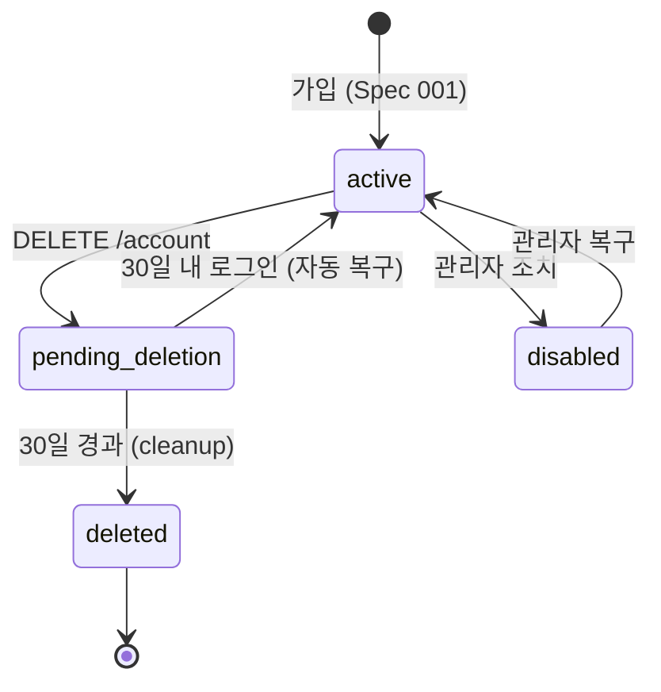
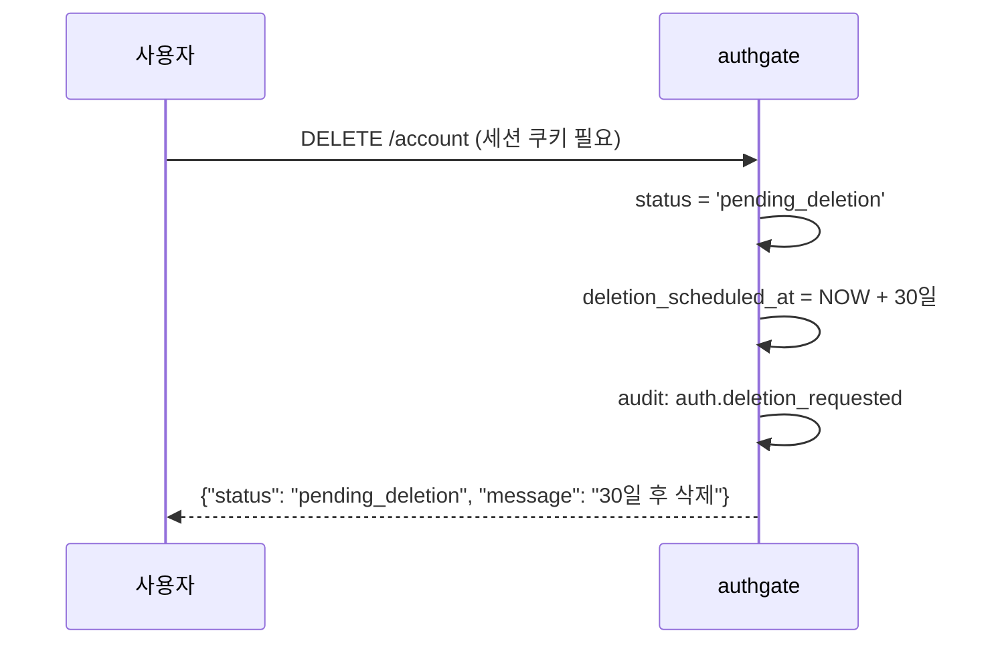
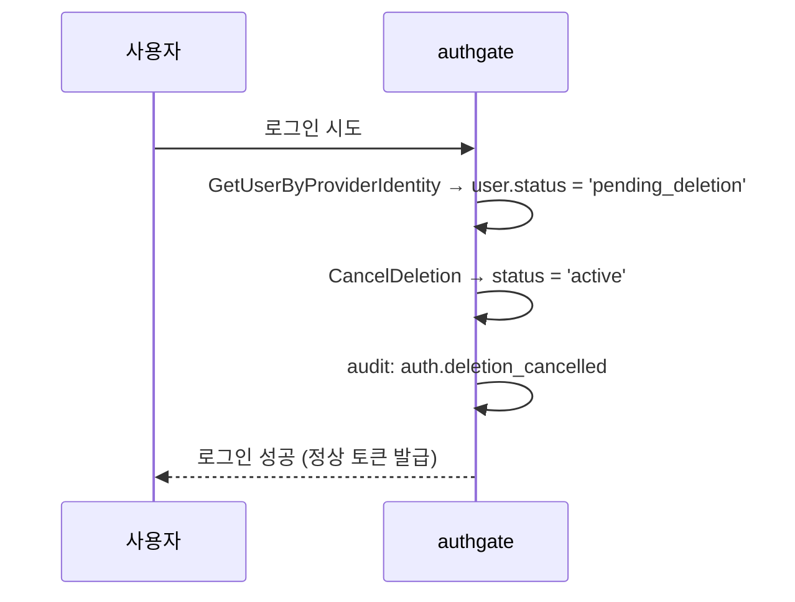

# Spec 006: 계정 Lifecycle

## 개요

authgate 계정의 생성부터 삭제까지 전체 상태 전이와 각 상태에서의 동작.

## 계정 상태



## 상태별 동작

| 상태 | 로그인 | 토큰 갱신 | 설명 |
|------|--------|----------|------|
| **active** | 허용 | 허용 | 정상 |
| **disabled** | 차단 | 차단 | 관리자가 정지. DB 직접 수정으로 복구 |
| **pending_deletion** | 허용 → active 복구 | 차단 | 30일 유예 기간 |
| **deleted** | 차단 | 차단 | PII 스크러빙 완료. 복구 불가 |

## 계정 삭제

### 삭제 요청



### 30일 유예 기간

유예 기간 중 사용자가 로그인하면 **자동 복구**:



### 실제 삭제 (PII 스크러빙)

30일 경과 후 cleanup 고루틴이 처리:

```sql
-- 개인정보 제거
UPDATE users SET
  email = 'deleted-' || id::text || '@deleted.invalid',
  name = NULL,
  avatar_url = NULL,
  status = 'deleted',
  deleted_at = NOW()
WHERE status = 'pending_deletion'
  AND deletion_scheduled_at < NOW();
```

삭제 시 함께 처리:
- `user_identities` — CASCADE 삭제 (Google 연결 해제)
- `sessions` — CASCADE 삭제
- `refresh_tokens` — 전부 revoke
- `audit_log` — 유지 (법적 증거)

### 재가입

삭제된 계정의 Google 계정으로 다시 로그인하면 **신규 가입**으로 처리:
- 새 user_id 발급
- 이전 데이터와 연결 없음
- 약관 재동의 필요

## 약관 재동의

약관 버전이 변경되면 (`TERMS_VERSION` 환경변수), 기존 사용자도 재동의 필요:

```
로그인 → HasAcceptedTerms(현재 버전) → false → terms.html → 동의 → 진행
```

## 에러 케이스

| 상황 | 응답 | HTTP |
|------|------|------|
| 비로그인 상태에서 삭제 요청 | `unauthorized` | 401 |
| 이미 pending_deletion인 계정 삭제 요청 | 무시 (멱등) | 200 |
| disabled 계정 로그인 시도 | `account_inactive` | 403 |
| deleted 계정 로그인 시도 | `account_inactive` | 403 |

## 감사 로그

| 이벤트 | 시점 |
|--------|------|
| `auth.deletion_requested` | DELETE /account |
| `auth.deletion_cancelled` | 유예 중 로그인 |
| `auth.inactive_user` | disabled/deleted 계정 로그인 시도 |
