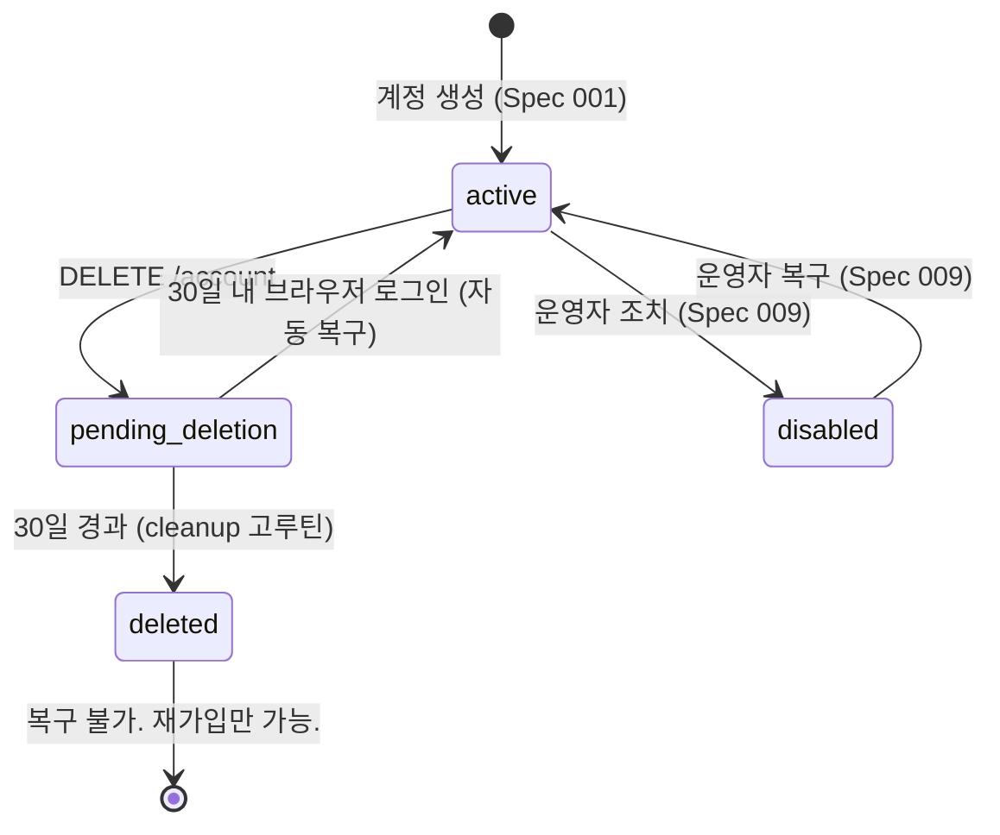
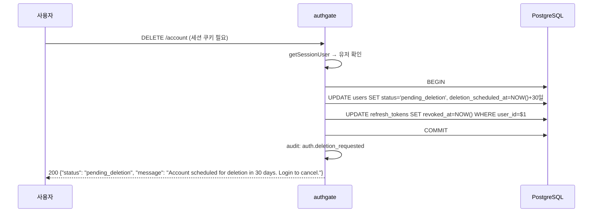
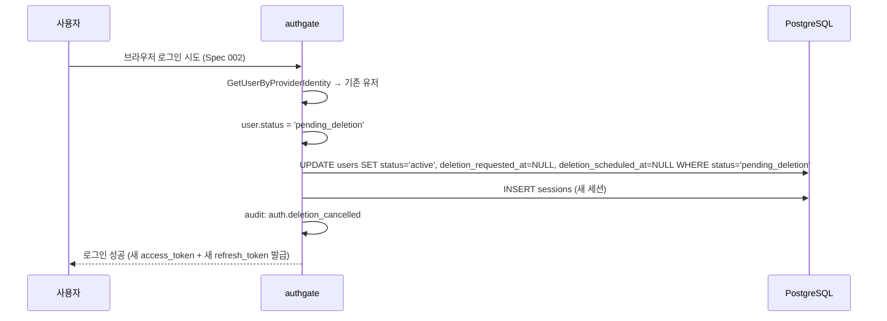

# Spec 006: 계정 Lifecycle

## 개요

authgate 계정의 생성부터 삭제까지 전체 상태 전이와 각 상태에서의 동작.
계정 생성은 [Spec 001 (가입)](001-signup.md)에서 다루며, 이 스펙은 생성 이후의 lifecycle에 집중한다.

## 전제

- authgate에서 zitadel/oidc는 **내장 라이브러리**다.
- 계정 생성은 **브라우저 로그인(Spec 002)에서만** 가능하다.
- 로그인 상태 판정은 [ADR-000](../adr/000-authgate-identity.md) 상태 판정 규칙을 따른다

## 관련 엔드포인트

| Method | Path | 내부 처리 | 설명 |
|--------|------|----------|------|
| DELETE | `/account` | authgate 핸들러 | 계정 삭제 요청 (30일 유예) |
| GET | `/health` | authgate 핸들러 | liveness 체크 |
| GET | `/ready` | authgate 핸들러 | readiness 체크 (DB 포함) |

계정 상태 변경은 로그인 플로우 내에서 자동 처리된다:
- `pending_deletion` → `active`: 브라우저 로그인(Spec 002) 시 자동 복구
- `disabled` → `active`: DB 직접 수정 (Spec 009 운영 참조)

## 계정 상태



## 상태별 동작

| 상태 | 브라우저 로그인 | Device/MCP 로그인 | 토큰 갱신 | 설명 |
|------|-------------|-----------------|----------|------|
| **active** | 허용 | 허용 | 허용 | 정상 |
| **disabled** | 차단 (403) | 차단 (403) | 차단 | 운영자 정지 |
| **pending_deletion** | 허용 → active 복구 | 차단 (403) | 차단 | 30일 유예 |
| **deleted** | `ErrNotFound` → 신규 가입 경로 | 차단 (403) | 차단 | PII 스크러빙 완료 + identity 제거 |

**pending_deletion 복구는 브라우저 로그인에서만 가능.**
CLI/MCP로는 복구할 수 없다 — 브라우저에서 먼저 로그인해야 한다.

## 계정 삭제

### 1단계: 삭제 요청



**삭제 요청 즉시 refresh_token 전부 revoke.** 기존 access_token은 만료(15분)를 기다린다.

### 2단계: 유예 기간 (30일)

유예 기간 중 사용자가 **브라우저로** 로그인하면 자동 복구:



**원자성 규칙**: RecoverUser 자체는 단일 UPDATE로 원자적이다. 세션 생성과 auth_request 완료는 별도 호출이지만, 각 단계가 실패해도 복구는 유지되고 다음 로그인에서 즉시 정상 완료된다 (재시도 멱등).

복구 후 **새 토큰이 발급된다** (기존 토큰은 삭제 요청 시 revoke됨).

### 3단계: 실제 삭제 (PII 스크러빙)

30일 경과 후 cleanup 고루틴이 처리 (단일 트랜잭션):

```sql
BEGIN;

-- 1. 연관 데이터 명시적 삭제
-- NOTE: UPDATE로는 CASCADE가 트리거되지 않으므로 명시적 DELETE 필요
DELETE FROM user_identities WHERE user_id = $1;
DELETE FROM sessions WHERE user_id = $1;
DELETE FROM refresh_tokens WHERE user_id = $1;

-- 2. PII 스크러빙 + 상태 전이
UPDATE users SET
  email = 'deleted-' || id::text || '@deleted.invalid',
  name = NULL,
  avatar_url = NULL,
  status = 'deleted',
  deleted_at = NOW()
WHERE id = $1
  AND status = 'pending_deletion'
  AND deletion_scheduled_at < NOW();

COMMIT;
```

**순서가 중요하다**: 연관 데이터를 먼저 삭제한 후 users를 UPDATE한다. FK CASCADE는 `DELETE FROM users` 시에만 동작하므로, `UPDATE users SET status='deleted'`에서는 자동 삭제가 발생하지 않는다.

### 재가입

**deleted 상태의 user row는 어떤 로그인에서도 재활성화되지 않는다** ([ADR-000 사이클 규칙](../adr/000-authgate-identity.md) 참조).

삭제 완료 후 같은 IdP 계정으로 로그인하면:
- `user_identities`가 3단계에서 명시적 삭제됨 → `GetUserByProviderIdentity` → `ErrNotFound`
- `ErrNotFound`이므로 **Spec 001 신규 가입 서브플로우로 진입** (기존 deleted user row와 무관)
- 새 user_id 발급, 이전 데이터와 연결 없음

deleted user의 scrub된 row는 DB에 남지만, 새 가입과는 어떤 관계도 맺지 않는다.

## Cleanup Lifecycle

authgate는 2종의 account cleanup을 별도 lifecycle로 관리한다:

| 종류 | 대상 | 조건 | 주기 |
|------|------|------|------|
| **deletion cleanup** | `pending_deletion` | `status='pending_deletion'` AND `deletion_scheduled_at < NOW()` | 이 스펙 3단계 |
| **token cleanup** | 만료/폐기된 토큰 | `expires_at < NOW()` 또는 `revoked_at IS NOT NULL` | Spec 005 참조 |

## 에러 케이스

| 상황 | 에러 코드 | HTTP | 설명 |
|------|----------|------|------|
| 비로그인 상태 삭제 요청 | `unauthorized` | 401 | 세션 쿠키 필요 |
| 이미 pending_deletion | — | 200 | 멱등 (재요청 무시) |
| disabled 계정 로그인 | `account_inactive` | 403 | |
| deleted 계정 로그인 (브라우저) | — | — | `user_identities` 삭제됨 → `ErrNotFound` → 신규 가입으로 처리 (Spec 001) |
| deleted 계정 로그인 (Device/MCP) | `account_not_found` | 403 | `user_identities` 삭제됨 → `ErrNotFound` → 브라우저 가입 필요 |
| pending_deletion + CLI/MCP 로그인 | `account_inactive` | 403 | 브라우저 복구만 가능 |

## 감사 로그

| 이벤트 | 시점 | 설명 |
|--------|------|------|
| `auth.deletion_requested` | DELETE /account | 삭제 요청 + refresh_token 즉시 revoke |
| `auth.deletion_cancelled` | 유예 중 브라우저 로그인 | 자동 복구 |
| `auth.deletion_completed` | cleanup 고루틴 PII 스크러빙 완료 | |
| `auth.inactive_user` | pending_deletion/disabled/deleted 로그인 시도 차단 | status 포함 |

## 다른 스펙 참조

| 참조 | 내용 |
|------|------|
| [Spec 001](001-signup.md) | 가입 (계정 생성). 삭제 후 재가입도 001 경유 |
| [Spec 002](002-browser-login.md) | pending_deletion 자동 복구 경로 |
| [Spec 005](005-token-lifecycle.md) | 계정 상태별 토큰 갱신 차단, access_token 15분 잔여 |
| [Spec 007](007-data-model.md) | users 상태 CHECK, audit_log 보존 정책 |
| [Spec 009](009-operations.md) | disabled 복구, cleanup 고루틴 |
