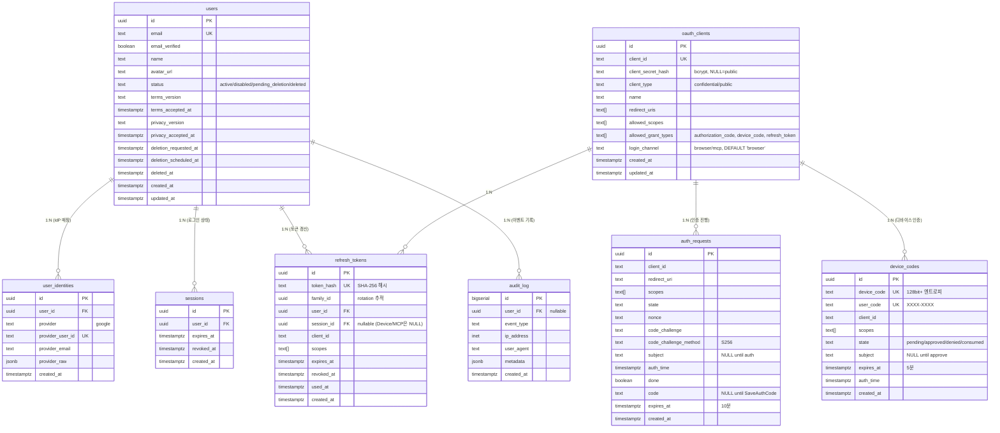

# Spec 007: 데이터 모델

## 개요

authgate가 소유하는 모든 데이터의 테이블 구조, 관계, 제약조건을 정의한다.
데이터 소유 범위는 [ADR-000](../adr/000-authgate-identity.md)의 "저장하는 데이터 / 저장하지 않는 데이터"를 따른다.

## 테이블 관계



## 테이블별 상세

### 영구 데이터

| 테이블 | 목적 | 수명 | 삭제 정책 |
|--------|------|------|----------|
| **users** | 신원 (sub, email, name, status) | 영구 | PII 스크러빙 (30일 유예 후) |
| **user_identities** | IdP 매핑 (Google sub ↔ 로컬 user) | 영구 | CASCADE (users 삭제 시) |
| **oauth_clients** | 등록된 앱 | 영구 | 수동 관리 |

### 세션/토큰 데이터

| 테이블 | 목적 | 수명 | 삭제 정책 |
|--------|------|------|----------|
| **sessions** | 로그인 상태 | SESSION_TTL (기본 24시간) | 만료 후 cleanup |
| **refresh_tokens** | 토큰 갱신 권한 | REFRESH_TOKEN_TTL (기본 30일) | 폐기 후 30일 뒤 hard delete |

### 임시 데이터

| 테이블 | 목적 | 수명 | 삭제 정책 |
|--------|------|------|----------|
| **auth_requests** | 로그인 진행 중 상태 | 10분 | 만료 후 1시간 뒤 cleanup |
| **device_codes** | CLI 로그인 진행 중 상태 | 5분 | 만료 후 1시간 뒤 cleanup |

### 감사 데이터

| 테이블 | 목적 | 수명 | 삭제 정책 |
|--------|------|------|----------|
| **audit_log** | 운영 이벤트 | 3년 보존 후 user_id 익명화 | 3년 후 user_id = NULL |

## 인덱스

```sql
-- users
CREATE UNIQUE INDEX idx_users_email ON users(email);
CREATE INDEX idx_users_deletion ON users(deletion_scheduled_at) WHERE deletion_scheduled_at IS NOT NULL;

-- user_identities
CREATE UNIQUE INDEX idx_identities_provider ON user_identities(provider, provider_user_id);
CREATE INDEX idx_identities_user ON user_identities(user_id);

-- sessions
CREATE INDEX idx_sessions_user ON sessions(user_id);
CREATE INDEX idx_sessions_expires ON sessions(expires_at);

-- refresh_tokens
CREATE UNIQUE INDEX idx_rt_hash ON refresh_tokens(token_hash);
CREATE INDEX idx_rt_family ON refresh_tokens(family_id);
CREATE INDEX idx_rt_user ON refresh_tokens(user_id);
CREATE INDEX idx_rt_expires ON refresh_tokens(expires_at) WHERE revoked_at IS NULL;

-- auth_requests
CREATE INDEX idx_ar_expires ON auth_requests(expires_at);
CREATE INDEX idx_ar_code ON auth_requests(code) WHERE code IS NOT NULL;

-- device_codes
CREATE UNIQUE INDEX idx_dc_device ON device_codes(device_code);
CREATE UNIQUE INDEX idx_dc_user ON device_codes(user_code);
CREATE INDEX idx_dc_expires ON device_codes(expires_at);

-- audit_log
CREATE INDEX idx_audit_user ON audit_log(user_id);
CREATE INDEX idx_audit_created ON audit_log(created_at);
```

## 제약조건

```sql
-- users
CHECK (status IN ('active', 'disabled', 'pending_deletion', 'deleted'))

-- device_codes
CHECK (state IN ('pending', 'approved', 'denied', 'consumed'))

-- user_identities
UNIQUE (provider, provider_user_id)
FOREIGN KEY (user_id) REFERENCES users(id) ON DELETE CASCADE

-- sessions
FOREIGN KEY (user_id) REFERENCES users(id) ON DELETE CASCADE

-- refresh_tokens
FOREIGN KEY (user_id) REFERENCES users(id) ON DELETE CASCADE
FOREIGN KEY (session_id) REFERENCES sessions(id) ON DELETE SET NULL

-- audit_log
FOREIGN KEY (user_id) REFERENCES users(id) ON DELETE SET NULL
```

**CASCADE는 `DELETE FROM users` 시에만 동작한다.** authgate는 계정 삭제 시 `UPDATE users SET status='deleted'`를 사용하므로 CASCADE가 트리거되지 않는다. 연관 데이터는 Spec 006 3단계에서 명시적으로 DELETE한다.

## client_id 참조 규칙

`auth_requests.client_id`, `device_codes.client_id`, `refresh_tokens.client_id`는 `oauth_clients.client_id`를 참조하지만 **FK를 걸지 않는다.**

이유:
- auth_requests, device_codes는 수분 내 만료되는 임시 데이터다. FK CASCADE가 이들의 cleanup과 결합되면 복잡도만 증가한다.
- oauth_clients는 수동 등록/관리이며 삭제 빈도가 극히 낮다 (Spec 009).

**운영 불변식**: 클라이언트 삭제 전 다음을 확인한다:
1. 해당 client_id의 auth_requests, device_codes가 전부 만료/소진되었는지 확인
2. 해당 client_id의 refresh_tokens를 전부 revoke
3. 확인 후 `DELETE FROM oauth_clients WHERE client_id = $1`

이 절차는 Spec 009 운영 문서에서 관리한다.

## session_id 규칙

`refresh_tokens.session_id`는 선택적(nullable)이다:

- **브라우저 로그인**: 세션 기반이므로 `session_id`를 설정할 수 있다.
- **Device/MCP 로그인**: 브라우저 세션과 독립적인 클라이언트 토큰이므로 `session_id`는 NULL이다.

**revoke / cleanup / 계정 삭제는 `user_id` 또는 `family_id` 기준으로 처리한다.** `session_id` 기준으로 처리하면 Device/MCP 토큰이 누락된다.

## 보안 규칙

| 규칙 | 적용 |
|------|------|
| refresh_token은 SHA-256 해시로 저장 | `token_hash` 컬럼 |
| client_secret은 bcrypt 해시로 저장 | `client_secret_hash` 컬럼 |
| access_token(JWT)은 DB에 저장하지 않음 | stateless |
| PII 스크러빙 시 email, name, avatar_url 제거 | `deleted` 상태 전이 시 |
| audit_log는 3년 후 user_id 익명화 | cleanup job |

## 감사 이벤트 (audit_log.event_type)

| 이벤트 | 시점 | metadata |
|--------|------|----------|
| `auth.signup` | 가입 | — |
| `auth.login` | 로그인 | `{channel: "browser\|device\|mcp"}` |
| `auth.terms_accepted` | 약관 동의 | `{terms_version, privacy_version}` |
| `auth.deletion_requested` | 탈퇴 요청 | — |
| `auth.deletion_cancelled` | 탈퇴 취소 (로그인 복구) | — |
| `auth.deletion_completed` | PII 스크러빙 완료 | — |
| `auth.device_approved` | 디바이스 승인 | — |
| `auth.device_denied` | 디바이스 거부 | — |
| `auth.refresh_reuse_detected` | 폐기된 refresh_token 재사용 탐지 | `{family_id}` |
| `auth.refresh_family_revoked` | family 전체 revoke (탈취 의심) | `{family_id}` |
| `auth.inactive_user` | 비활성 유저 로그인 시도 | `{status}` |
