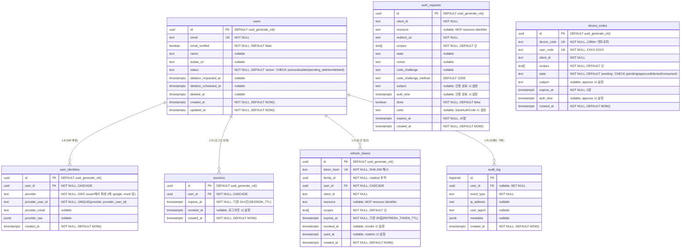

# Spec 007: 데이터 모델

## 개요

authgate가 소유하는 모든 데이터의 테이블 구조, 관계, 제약조건을 정의한다.
데이터 소유 범위는 [ADR-000](../adr/000-authgate-identity.md)의 "저장하는 데이터 / 저장하지 않는 데이터"를 따른다.

## 테이블 관계



## 테이블별 상세

### 영구 데이터

| 테이블 | 목적 | 수명 | 삭제 정책 |
|--------|------|------|----------|
| **users** | 신원 (sub, email, name, status) | 영구 | PII 스크러빙 (30일 유예 후) |
| **user_identities** | IdP 매핑 (IdP sub ↔ 로컬 user) | 영구 | CASCADE (users 삭제 시) |

### 설정 데이터 (DB 외부)

| 데이터 | 목적 | 저장 위치 | 관리 방식 |
|--------|------|----------|----------|
| **클라이언트 설정** | 등록된 앱 (client_id, redirect_uri 등) | `clients.yaml` → 메모리 | YAML 파일 수정 후 서버 재시작 |
| **CIMD 클라이언트** | MCP 클라이언트 (client_id = URL) | 클라이언트가 호스팅 → on-demand fetch | 저장 없음, HTTP 캐시만 |

### 세션/토큰 데이터

| 테이블 | 목적 | 수명 | 삭제 정책 |
|--------|------|------|----------|
| **sessions** | 로그인 상태 | SESSION_TTL (기본 24시간) | 만료 후 cleanup |
| **refresh_tokens** | 토큰 갱신 권한 | REFRESH_TOKEN_TTL (기본 30일) | 폐기 후 30일 뒤 hard delete |

### 임시 데이터

| 테이블 | 목적 | 수명 | 삭제 정책 |
|--------|------|------|----------|
| **auth_requests** | 로그인 진행 중 상태 | 10분 | 만료 후 1시간 뒤 cleanup |
| **device_codes** | CLI 로그인 진행 중 상태 | 5분 | 만료 후 1시간 뒤 cleanup |

Browser/MCP callback의 원자적 완료 경로에서는 `auth_requests.done=false`인 행만 처리한다. 해당 경로는 `auth_requests` 완료와 `sessions` 생성을 단일 트랜잭션으로 처리하며, 만료/미존재/이미완료 auth_request이면 전체 작업이 실패하고 session도 생성되지 않는다. 재시도 가능한 기존 완료 경로는 이미 완료된 `auth_requests`도 만료 전이면 멱등적으로 갱신할 수 있다.

### 감사 데이터

| 테이블 | 목적 | 수명 | 삭제 정책 |
|--------|------|------|----------|
| **audit_log** | 운영 이벤트 | 3년 보존 후 user_id 익명화 | 3년 후 user_id = NULL |

#### event_type 목록

| event_type | 설명 | 발생 위치 |
|------------|------|----------|
| `auth.signup` | 신규 가입 완료 | 브라우저 로그인 (신규 유저) |
| `auth.login` | 로그인 성공 (callback 기반) | 브라우저/Device/MCP callback 로그인 |
| `auth.inactive_user` | 비활성 유저 로그인 시도 차단 | 브라우저/Device/MCP 로그인 |
| `auth.device_approved` | Device 코드 승인 | Device 승인 페이지 |
| `auth.device_denied` | Device 코드 거부 | Device 승인 페이지 |
| `auth.deletion_requested` | 계정 삭제 요청 | 계정 삭제 API |
| `auth.deletion_cancelled` | 삭제 예정 계정 복구 (재로그인) | 브라우저 로그인 |
| `auth.deletion_completed` | PII 스크러빙 완료 | cleanup 배치 |
| `auth.refresh_reuse_detected` | refresh token 재사용 감지 | 토큰 갱신 |
| `auth.refresh_family_revoked` | refresh token 패밀리 전체 폐기 | 토큰 갱신 (재사용 시) |

## 인덱스

현재 `migrations/001_init.sql`은 테이블 제약(UNIQUE/PK/FK) 외에 별도 보조 인덱스를 생성하지 않는다.

운영에서 조회 패턴이 커지면 다음 원칙으로 인덱스를 추가한다:
1. 실제 병목 쿼리를 기준으로 추가한다.
2. cleanup 경로(`expires_at`)와 토큰 경로(`token_hash`, `family_id`)를 우선 고려한다.
3. 추가 시 이 문서와 마이그레이션을 함께 갱신한다.

## 제약조건

```sql
-- users
CHECK (status IN ('active', 'disabled', 'pending_deletion', 'deleted'))

-- device_codes
CHECK (state IN ('pending', 'approved', 'denied', 'consumed'))

-- user_identities
UNIQUE (provider, provider_user_id)
FOREIGN KEY (user_id) REFERENCES users(id) ON DELETE CASCADE

-- sessions
FOREIGN KEY (user_id) REFERENCES users(id) ON DELETE CASCADE

-- refresh_tokens
FOREIGN KEY (user_id) REFERENCES users(id) ON DELETE CASCADE
-- audit_log
FOREIGN KEY (user_id) REFERENCES users(id) ON DELETE SET NULL
```

**CASCADE는 `DELETE FROM users` 시에만 동작한다.** authgate는 계정 삭제 시 `UPDATE users SET status='deleted'`를 사용하므로 CASCADE가 트리거되지 않는다. 연관 데이터는 Spec 006 3단계에서 명시적으로 DELETE한다.

## client_id 참조 규칙

`auth_requests.client_id`, `device_codes.client_id`, `refresh_tokens.client_id`는 클라이언트 설정의 `client_id`를 논리적으로 참조한다. 클라이언트 설정은 DB가 아닌 메모리(YAML 또는 CIMD)에 존재하므로 FK는 없다.

클라이언트 종류별 참조:
- **YAML 클라이언트**: `client_id`는 `clients.yaml`에 정의된 문자열
- **CIMD 클라이언트**: `client_id`는 MCP 클라이언트가 호스팅하는 메타데이터 URL

연관 데이터는 자연 소멸한다:
- auth_requests, device_codes: 임시 데이터 (10분/5분) → 자연 만료 후 cleanup 삭제
- refresh_tokens: 클라이언트가 메모리에서 사라져도 만료까지 DB에 남음. 갱신 시도 시 클라이언트 조회 실패로 거부 → 만료 후 cleanup 삭제

## auth_requests.resource 규칙

`auth_requests.resource`는 MCP authorization에서 사용하는 protected resource 식별자다.

```text
Browser / Device
  -> NULL

MCP
  -> canonical resource URI 저장
```

규칙:
1. `/authorize` 요청의 `resource`를 `auth_requests.resource`에 저장
2. `/oauth/token` 요청의 `resource`와 일치해야 한다
3. 성공적인 code exchange가 끝나면 auth_request와 함께 정리된다

## 보안 규칙

| 규칙 | 적용 |
|------|------|
| refresh_token은 SHA-256 해시로 저장 | `token_hash` 컬럼 |
| client_secret은 bcrypt 해시로 저장 | `clients.yaml`의 `client_secret_hash` 필드 |
| access_token(JWT)은 DB에 저장하지 않음 | stateless |
| PII 스크러빙 시 email, name, avatar_url 제거 | `deleted` 상태 전이 시 |
| audit_log는 3년 후 user_id 익명화 | cleanup job |

## 감사 이벤트 (audit_log.event_type)

| 이벤트 | 시점 | metadata |
|--------|------|----------|
| `auth.signup` | 가입 | — |
| `auth.login` | callback 기반 로그인 | `{channel: "browser\|device\|mcp"}` |
| `auth.deletion_requested` | 탈퇴 요청 | — |
| `auth.deletion_cancelled` | 탈퇴 취소 (로그인 복구) | — |
| `auth.deletion_completed` | PII 스크러빙 완료 | TX 커밋 이후 best-effort 기록 |
| `auth.device_approved` | 디바이스 승인 | — |
| `auth.device_denied` | 디바이스 거부 | — |
| `auth.refresh_reuse_detected` | 폐기된 refresh_token 재사용 탐지 | `{family_id}` |
| `auth.refresh_family_revoked` | family 전체 revoke (탈취 의심) | `{family_id}` |
| `auth.inactive_user` | pending_deletion/disabled/deleted 로그인 시도 | `{status, channel}` |
